!# Screener Collection

!## A list of various screeners (and other cool) DVD's I have. 

## Intro: 

If you find yourself interested in my collection, or perhaps know something I don't, feel free to connect with me. 

#WARN# All screeners contained in this blog have been legally acquired through second-hand marketplaces. I have always had a personal rule to never purchase any screeners for unreleased content, and to never purchase any screeners that have been produced in the last 12 months (to ensure that the content is no longer in the award season). This is done to deliberately avoid possessing stolen unreleased content, or content that has active confidentiality. 

#WARN# This blog post will be extremely large, contains numerous images, and will be slated for migration to its own platform/website if it exceeds the size limit for my personal website repo. Despite lazy loading being enabled for the entire blog, be weary of your bandwidth usage. If the page migrates, please consult the homepage as a new link will likely be posted under the blogs section. 

#NOTE# Some covers may have been post-edited to be stitched together, especially if the case folds out to be significantly long. All image collages read from left-to-right unless otherwise specified.

#NOTE# Please note that these screeners can both physically and digitally contain sensitive information, such as personal details or watermarks that trace back to Screen Actor Guild (or other unionized) members or login codes to secure FYC portals. Personal or identifiable details have been redacted. 

## Collection: 

#DROP# How To Train Your Dragon: The Hidden World - DreamWorks - 2018

### Intro: 
A screener for one of DreamWorks [later installments](https://www.imdb.com/title/tt2386490/) in the How To Train Your Dragon series. 

### Digital content:
File listing: 
```
.
├── AUDIO_TS
└── VIDEO_TS
    ├── VIDEO_TS.BUP
    ├── VIDEO_TS.IFO
    ├── VIDEO_TS.VOB
    ├── VTS_01_0.BUP
    ├── VTS_01_0.IFO
    ├── VTS_01_0.VOB
    ├── VTS_01_1.VOB
    ├── VTS_02_0.IFO
    ├── VTS_02_0.VOB
    ├── VTS_02_1.VOB
    ├── VTS_02_2.VOB
    ├── VTS_02_3.VOB
    ├── VTS_02_4.VOB
    ├── VTS_02_5.VOB
    └── VTS_02_6.VOB
```

Screenshots:
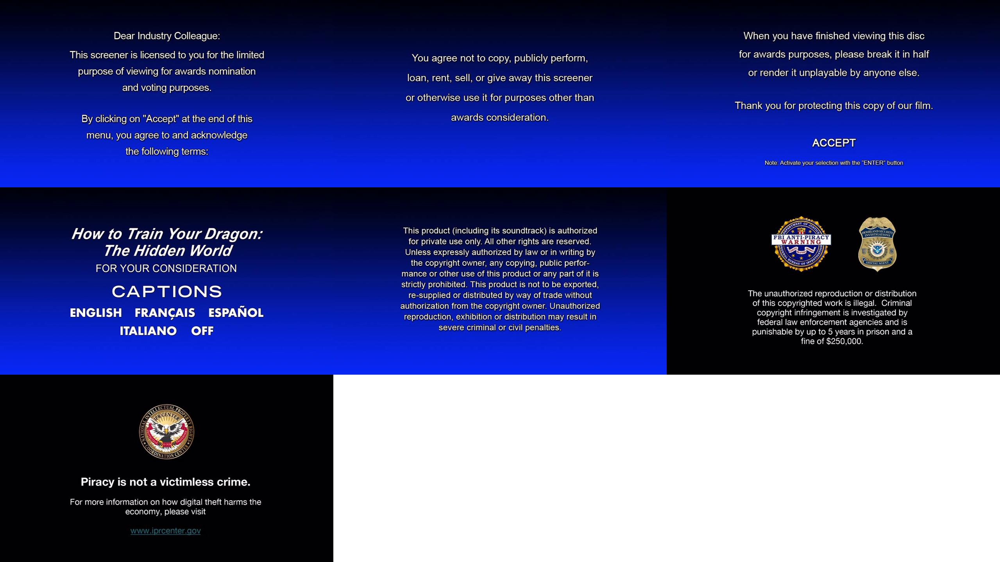
#CAPT# Images of all content before the film starts (3 images per row). Another disc destruction warning on 3rd screen.
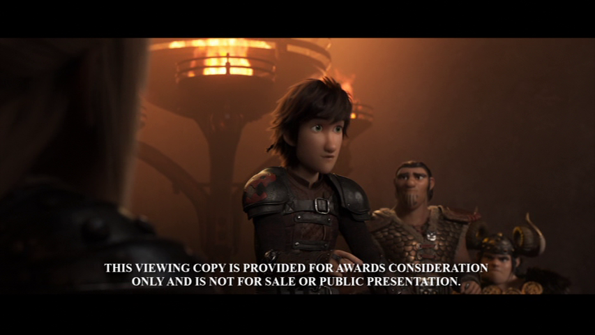
#CAPT# Screenshot of the watermark.
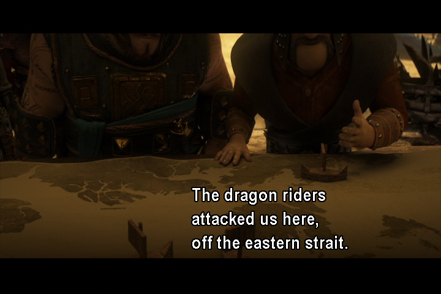
#CAPT# Screenshot of the subtitle programming.

#PORD#

#DROP# Emmy Screener Set - Netflix - 2016

### Intro:
This thing was **infamous** during the awards season for the sheer size and weight of the set. It [made the news](https://www.independent.co.uk/arts-entertainment/tv/news/netflix-makes-a-statement-by-sending-emmy-voters-20-pounds-worth-of-screeners-a7068476.html), and weighed in at [over 20 pounds](https://static.independent.co.uk/s3fs-public/thumbnails/image/2016/06/07/08/emmys.jpg). Even more impressive is that guild members who received this behemoth never actually paid for it, they were shipped courtesy of Netflix for the award season. 

And I got one. 

I bought my unit still sealed in the plastic wrap, however I had to unseal it just to see what I was missing out on. Each box comes with a program card and the DVD booklets for each show and film. 

### Physical contents: 

#### Case: 

Box Photos: 

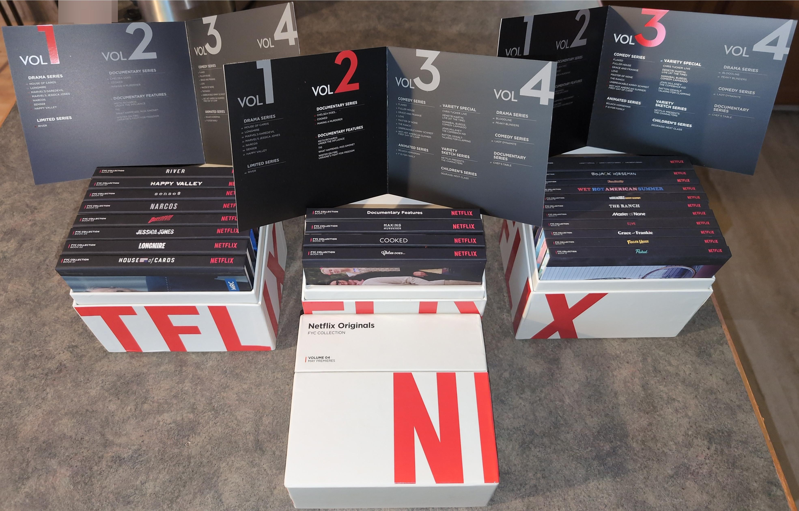

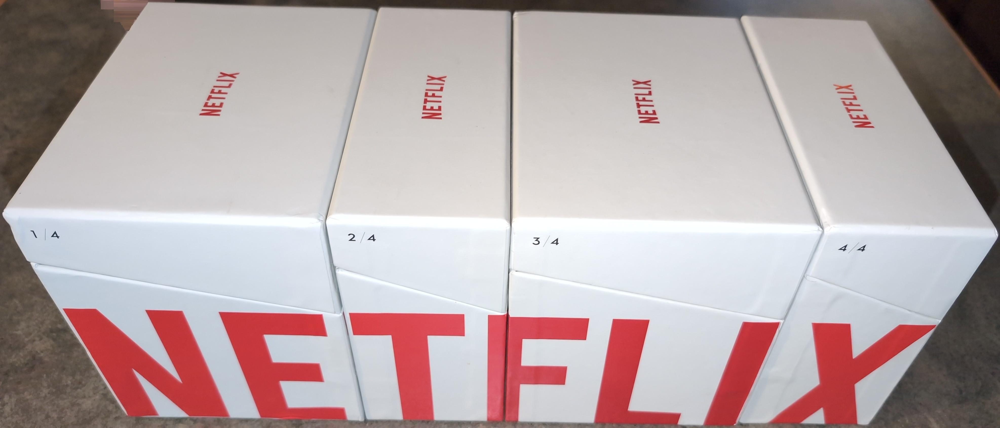

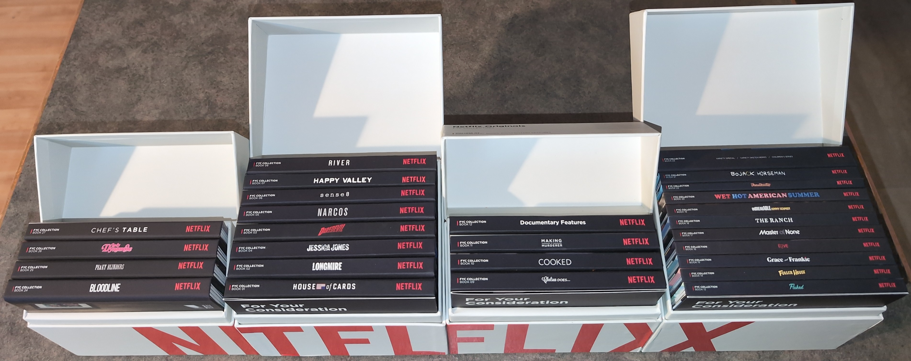

Program Card: 

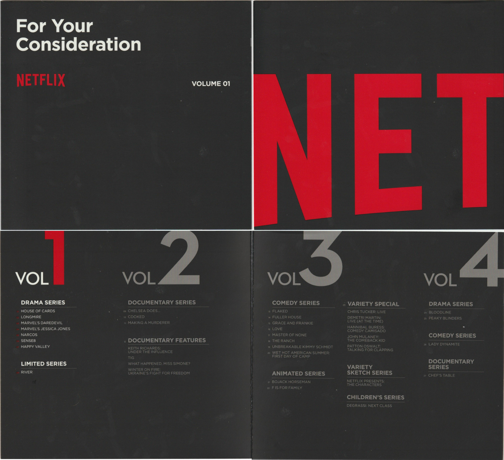
#CAPT# Volume 1's program card included in the box. Other program cards wont be included as they are all completely identical (as shown previously). TOP: Front and back of card. BOTTOM: Inside of card.

Volume specific: 

#DROP# Volume 1
Dimensions: 
* Height: 6 1/2 inches.
* Width: 7 1/4 inches.
* Depth: 5 1/2 inches.

Case:

#CAPT# Scan of volume 1 box. In order: left side, front side, right side. The rear side of this box has nothing (white).
#PORD#

#DROP# Volume 2
Dimensions: 
* Height: 6 1/2 inches.
* Width: 7 1/4 inches.
* Depth: 3 inches. 

Case:
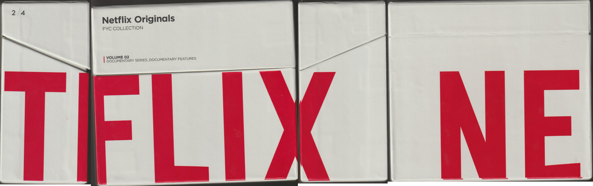
#CAPT# Scan of volume 2 box. In order: left side, front side, right side, back side.
#PORD#

#DROP# Volume 3
Dimensions: 
* Height: 6 1/2 inches.
* Width: 7 1/4 inches.
* Depth: 5 1/2 inches. 

Case:
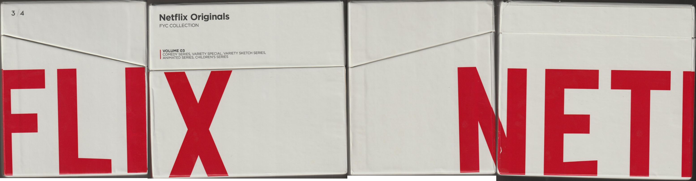
#CAPT# Scan of volume 3 box. In order: left side, front side, right side, back side.
#PORD#

#DROP# Volume 4
Dimensions: 
* Height: 6 1/2 inches.
* Width: 7 1/4 inches.
* Depth: 3 inches. 

Case:
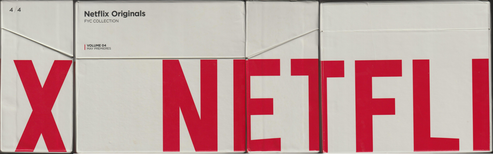
#CAPT# Scan of volume 4 box. In order: left side, front side, right side, back side.
#PORD#

### Subsequent Programs:

#DROP# Book 1/27: House of Cards
Nothing yet. 
#PORD# 

#DROP# Book 2/27: Longmire
Nothing yet
#PORD# 

#PORD# 

#DROP# Manchester By The Sea - Amazon Studios - 2016

### Intro:

A screener for the film [Manchester By The Sea](https://www.imdb.com/title/tt4034228/) for the SAG-AFTRA awards consideration. I watched a bit of the film from the screener disc and its a very well-made film.

### Digital content:

File listing: 
```
.
├── AUDIO_TS
└── VIDEO_TS
    ├── VIDEO_TS.BUP
    ├── VIDEO_TS.IFO
    ├── VIDEO_TS.VOB
    ├── VTS_01_0.BUP
    ├── VTS_01_0.IFO
    ├── VTS_01_1.VOB
    ├── VTS_01_2.VOB
    ├── VTS_01_3.VOB
    ├── VTS_01_4.VOB
    └── VTS_01_5.VOB
```

Screenshots: 
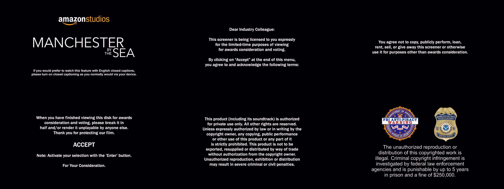
#CAPT# Images of all content before the film starts (3 images per row). Notice how the 4th screen literally instructs the viewer to destroy the DVD when they are finished with it. 
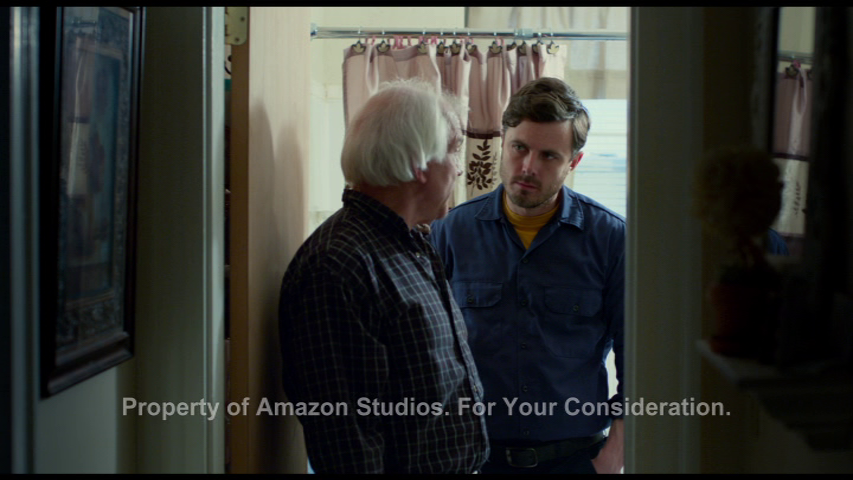
#CAPT# Screenshot of the watermark.
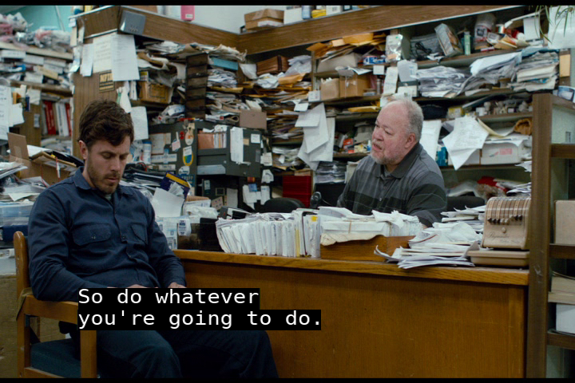
#CAPT# Screenshot of the subtitle programming.

### Physical content: 

#### Case: 

Ships in a relatively standard foldout-style case. Case feels constructed from cardboard. 

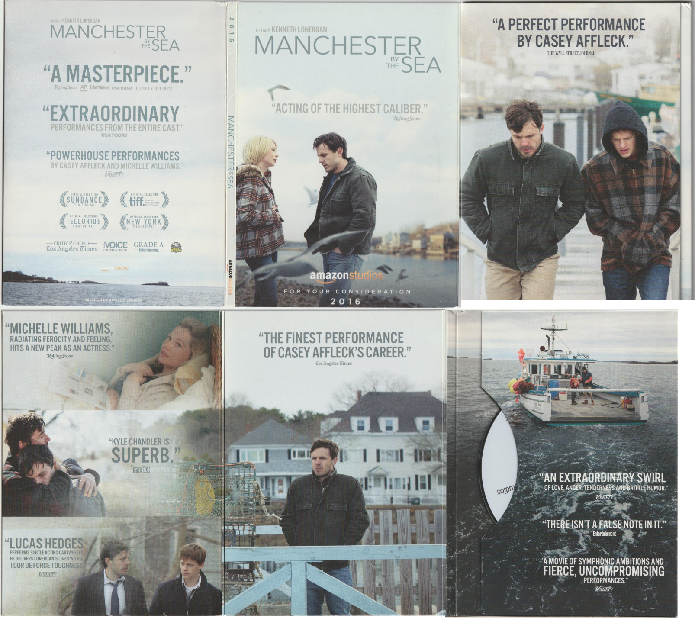
#CAPT# TOP: Exterior content of the case that folds out. BOTTOM: Inside content of the case that folds out. 


#### DVD:

The disc itself is pretty much a standard Amazon issued disc. It contains none of the features branding or artwork. 

#IMGSML# ManchesterByTheSea2016SAGAFTA/dvd.png

**Redacted content:**

1) Identifiable serial number/ID with barcode. 

#### SAG-AFTRA Voting Card: 

This screener also contained a rather rare and interesting item, that being the SAG-AFTRA calling card still inside the screeners case.    

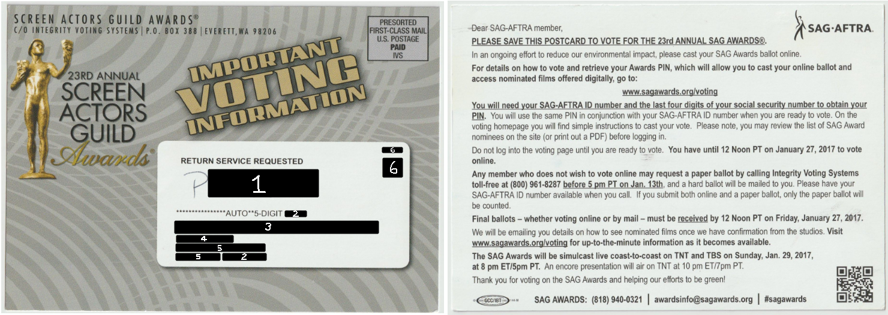

**Redacted content:**
1) Handwritten 7-character code, likely either a code to sign in digitally or tracking information.
2) ZIP code for recipient.
3) Intelligent mail barcode. 
4) Recipient name. 
5) Recipient address. 
6) Internal postal tracking codes. 

#PORD#