!# Screener Collection

!## A list of various screeners (and other cool) DVD's I have. 

## Intro: 

This article is an in-depth analysis and study into the film industry, its behaviors, and how it operates during the award season by using screener DVD's. 

If you find yourself interested in my collection, or perhaps know something I don't, feel free to connect with me. 

#WARN# Any enterprises seeking to contact the operator of this page regarding the content displayed should send their concerns and reasons for contact directly to the following addresses instead of the hosting provider: [email 1](mailto:g0@beyondgone.xyz), [email 2](mailto:globbruh@proton.me). Expect mail to be read between 24-48 hours. Any communication sent to these emails is subject to publication. 

#WARN# All screeners contained in this blog have been legally acquired through second-hand marketplaces. I have always had a personal rule to never purchase any screeners for unreleased content, and to never purchase any screeners that have been produced in the last 12 months (to ensure that the content is no longer in the award season). This is done to deliberately avoid possessing stolen unreleased content, or content that has active confidentiality. 

#WARN# This blog post will be extremely large, contains numerous images, and will be slated for migration to its own platform/website if it exceeds the size limit for my personal website repo. Despite lazy loading being enabled for the entire blog, be weary of your bandwidth usage. If the page migrates, please consult the homepage as a new link will likely be posted under the blogs section. 

#NOTE# Most content has been post-edited to be stitched together, especially if cases folds out to be significantly long. All image collages read from left-to-right unless otherwise specified.

#NOTE# All entries are categorized by year. The year is determined from the year of the screeners production (the one printed on the box), not the year of the presentations release.

#NOTE# Please note that sensitive information contained on the screeners has been redacted. Please consult the FAQ for more information. 

#DROP# FAQ

**Why do some of the screeners on DVD mention videocassettes or look like they came from a tape?**

A long time ago before DVD's were mainstream, some guild members (and video rental stores) would receive VHS screeners. These would be the production essentially copied to a videocassette tape, to which the recipient would then insert and play. During the VHS-to-DVD era from the early 2000's, some guild members had abandoned VHS in favor of DVD while others were still relying on VHS. This created a conundrum where studios needed to keep track of which members preferred which type of media, which led to high costs due to producing the same material across different media formats. Sometimes companies would cut costs by taking internal VHS copies of their production and burn the digitized version to DVD. This would sometimes leave mentions that the viewer was watching on a VHS or would have lower quality despite using optical media. 

**Why are there no really recent titles (even with your self-imposed rules)?**

Aside from my personal rules as described in the warnings above, many guilds and award ceremonies have simply phased out optical media entirely. Guild members will often access their content through codes emailed (or mailed) to them, and stream it from a dedicated FYC page provisioned by the studio/publisher. Optical media also had issues where it was easy to pass around, and studios often could not physically track where the disc itself went. With streaming, those risks are evaporated. Leaks and unauthorized logins are also extremely easy to remediate and troubleshoot with streaming, as there is a complete log of the members activity stored on the studios infrastructure. Optical media also had environmental risks, as guild members would be instructed to destroy their screener DVD's leading to significant plastic waste buildup.

**Why is the same show split into multiple sets of screeners, sometimes with different episodes?** 

Award ceremonies (especially the Emmy's) work on very specific per-category basis, such as those separated by both genre and role. Studios will often press and ship multiple screeners to target these specific roles as opposed to one big screener collection. Think one disc set for the main actors, and another disc set for the guest actors. This also allows studios to physically separate the content you will be ingesting for that category, so that other episodes don't bleed into the voters decision-making, or leave them searching for the specific actor across multiple episodes. Online FYC portals still have the control to segment their content for voter accessibility and ease-of-use, however most award ceremonies no longer permit optical media to be mailed. 

**What is a Technicolor security seal (or security seals in general)?**

During award seasons piracy groups knew when FYC content would ship from studios and press factories to the voters. Studios knew that once discs left the warehouse, they needed to trust the mail system to ensure that the discs make it to their destination and remain confidential. Theft was becoming rampant due to intermediary groups from shipping companies or office associates being incentivized by piracy groups to steal the disc or mailer itself before the recipient could actually receive it. Once the disc (or a copy of it) is in the hands of a piracy group, they would rush as fast as possible to release the film illegally for scenegroup reputation, especially considering some of these films were HD versions of unreleased blockbuster hits. To discourage this, Technicolor made a security seal that would be stuck to the mailers covers to ensure the mailer cannot be opened until either the sticker is peeled off (which leaves VOID text on the package) or is cut, which is also noticeable. If the recipient received a mailer with a broken seal, they would be instructed to report the tampering to the studio who shipped it so they can investigate who is responsible. 

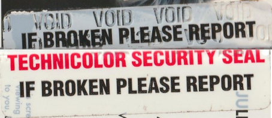
#CAPT# Example of a Technicolor security seal with each side of the sticker put together.

**Why is there so many things redacted?**

Awards screeners both physically and digitally contain sensitive information, such as personal details, watermarks, or FYC portal login codes that trace directly back to Screen Actor Guild members or other unionized members. Studios also partnered with massive DVD pressing companies to make custom pressings of these discs, and as such some have hardware-level identifiers printed on them. In this blog, anything that could trace back to a guild member has been redacted as the punishments inside these circles for not destroying or returning copies is severe. Remember that these discs (at the time of their distribution) contained unreleased films, and piracy groups would do anything they could to get their hands on them. 

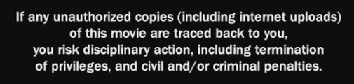
#CAPT# This screener explains exactly what could happen to guild members whose screeners land in the hands of pirates seeking unreleased blockbuster hits. 

#PORD#

## Collection: 

#DROP# 2023 - Origin - NEON

### Intro:

[Priscilla](https://www.imdb.com/title/tt22041854/) is a film that follows Priscilla Presley, rock legend Elvis Presley's wife. Priscilla is also named as a writer for this film. 

### Physical content: 

#### Case: 

Ships in a standard mailer case. Case feels constructed from cardboard.

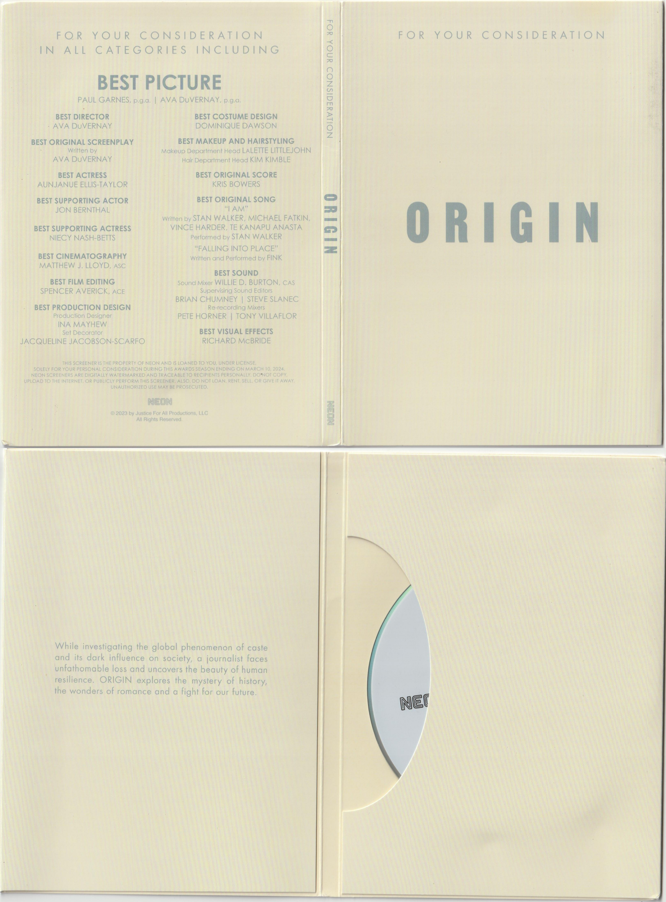
#CAPT# TOP: Exterior content of the case. BOTTOM: Inside content of the case. 

#### DVD: 

DVD containing the film.

#IMGSML# Origin2023/dvd.png

**Redacted content:**
1) Identifiable serial number/ID with barcode. 

### Digital content:
File listing: 
```
├── AUDIO_TS
└── VIDEO_TS
    ├── VIDEO_TS.BUP
    ├── VIDEO_TS.IFO
    ├── VTS_01_0.BUP
    ├── VTS_01_0.IFO
    ├── VTS_01_0.VOB
    ├── VTS_01_1.VOB
    ├── VTS_01_2.VOB
    ├── VTS_01_3.VOB
    ├── VTS_01_4.VOB
    ├── VTS_01_5.VOB
    ├── VTS_02_0.BUP
    ├── VTS_02_0.IFO
    ├── VTS_02_0.VOB
    ├── VTS_02_1.VOB
    ├── VTS_03_0.BUP
    ├── VTS_03_0.IFO
    ├── VTS_03_0.VOB
    └── VTS_03_1.VOB
```

Screenshots:
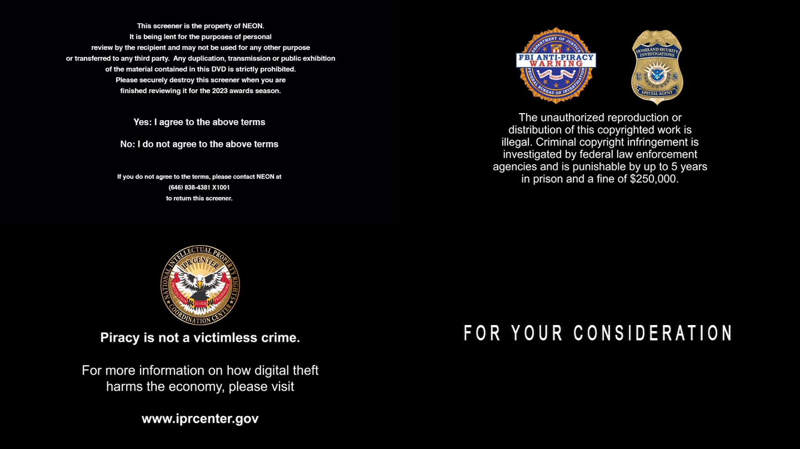
#CAPT# Images of all content before the film starts. Selecting the NO option does nothing.
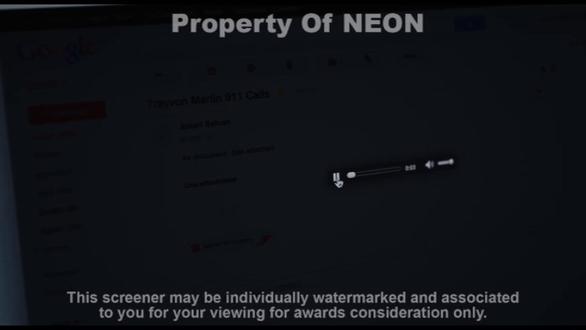
#CAPT# Screenshot of the watermark. This one is more intrusive than usual.
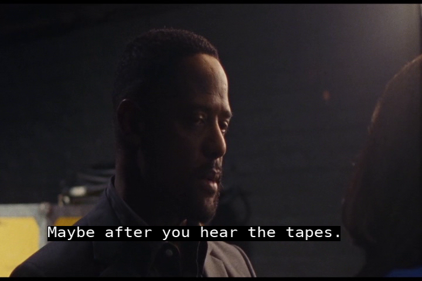
#CAPT# Screenshot of the subtitle programming.

#PORD#

#DROP# 2023 - Priscilla - A24

### Intro:

[Priscilla](https://www.imdb.com/title/tt22041854/) is a film that follows Priscilla Presley, rock legend Elvis Presley's wife. Priscilla is also named as a writer for this film. 

### Physical content: 

#### Case: 

Ships in a standard mailer case. Case feels constructed from cardboard.

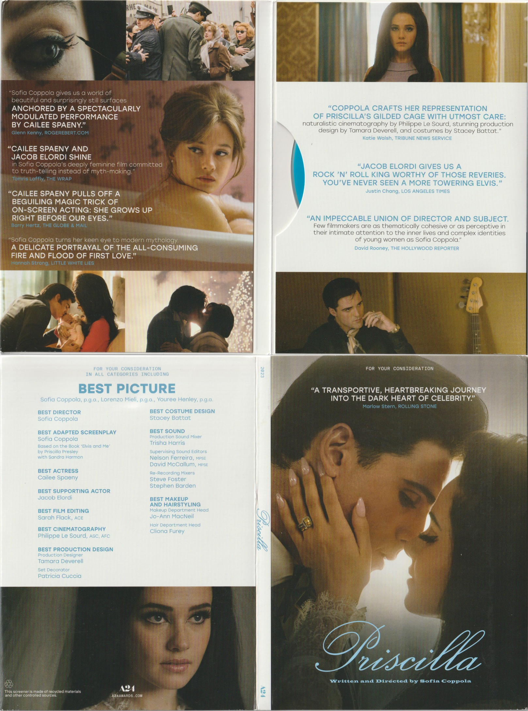
#CAPT# TOP: Inside content of the case. BOTTOM: Exterior content of the case. 

#### DVD: 

DVD containing the film.

#IMGSML# Priscilla/dvd.png

### Digital content:
File listing: 
```
├── AUDIO_TS
└── VIDEO_TS
    ├── VIDEO_TS.BUP
    ├── VIDEO_TS.IFO
    ├── VIDEO_TS.VOB
    ├── VTS_01_0.BUP
    ├── VTS_01_0.IFO
    ├── VTS_01_0.VOB
    ├── VTS_01_1.VOB
    ├── VTS_01_2.VOB
    ├── VTS_01_3.VOB
    ├── VTS_01_4.VOB
    ├── VTS_01_5.VOB
    ├── VTS_01_6.VOB
    └── VTS_01_7.VOB
```

Screenshots:
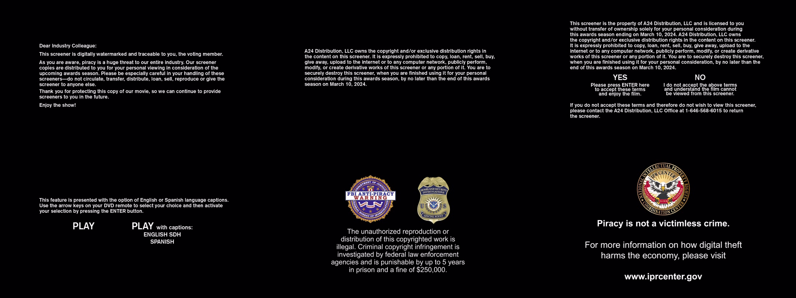
#CAPT# Images of all content before the film starts. Selecting the NO option returns DVDNAV_STOP, a command from the DVD letting the DVD player know to halt playback.
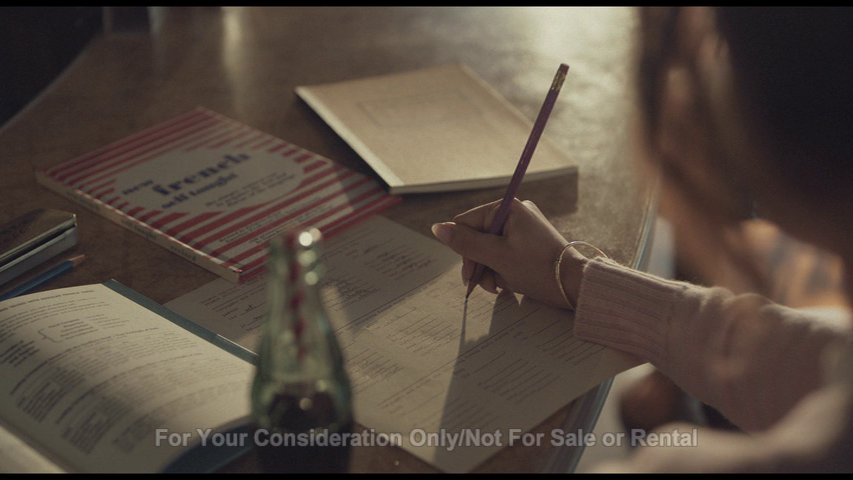
#CAPT# Screenshot of the watermark.
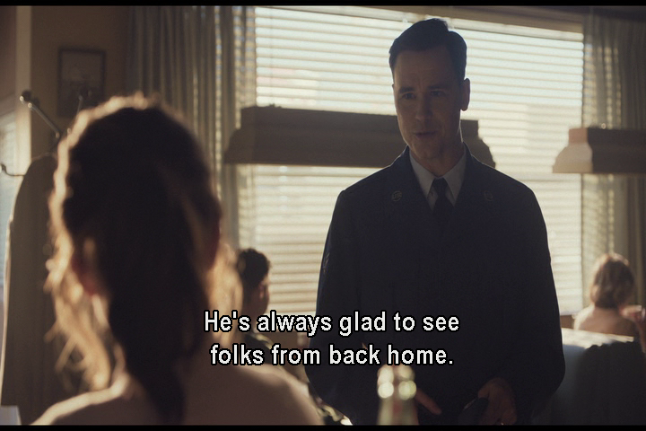
#CAPT# Screenshot of the subtitle programming. Spanish subtitles use the same programming.

#PORD#

#DROP# 2020 - Herself - Amazon Studios

### Intro:

[Herself](https://www.imdb.com/title/tt9902160/) is a rather fascinating Irish film that follows a single mother building their own home. The films budget is not public (though based off the licensed music it must of been moderately high), but it did gross 3/4 of a million.

### Physical content: 

#### Case: 

Ships in a standard eco-friendly mailer.

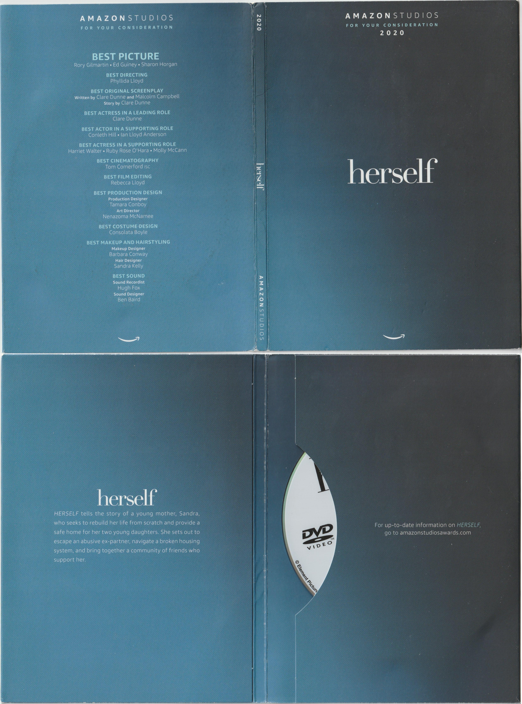
#CAPT# TOP: Exterior content of the case. BOTTOM: Inside content of the case. 

#### DVD: 

DVD containing the film. The disc's labeling is very to the point.

#IMGSML# Herself/dvd.png

**Redacted content:**
1) Middle hub has suspicious notches imprinted into it. Its not known whether this is damage or some form of marking/keying, but its suspicious enough that it should be redacted. 
2) Identifiable serial number/ID with barcode. 

### Digital content:
File listing: 
```
├── AUDIO_TS
└── VIDEO_TS
    ├── VIDEO_TS.BUP
    ├── VIDEO_TS.IFO
    ├── VTS_01_0.BUP
    ├── VTS_01_0.IFO
    ├── VTS_01_1.VOB
    ├── VTS_02_0.BUP
    ├── VTS_02_0.IFO
    ├── VTS_02_0.VOB
    ├── VTS_02_1.VOB
    ├── VTS_03_0.BUP
    ├── VTS_03_0.IFO
    ├── VTS_03_1.VOB
    ├── VTS_04_0.BUP
    ├── VTS_04_0.IFO
    ├── VTS_04_0.VOB
    ├── VTS_04_1.VOB
    ├── VTS_05_0.BUP
    ├── VTS_05_0.IFO
    ├── VTS_05_1.VOB
    ├── VTS_05_2.VOB
    ├── VTS_05_3.VOB
    ├── VTS_05_4.VOB
    ├── VTS_05_5.VOB
    ├── VTS_06_0.BUP
    ├── VTS_06_0.IFO
    ├── VTS_06_1.VOB
    ├── VTS_07_0.BUP
    ├── VTS_07_0.IFO
    └── VTS_07_1.VOB
```

Screenshots:
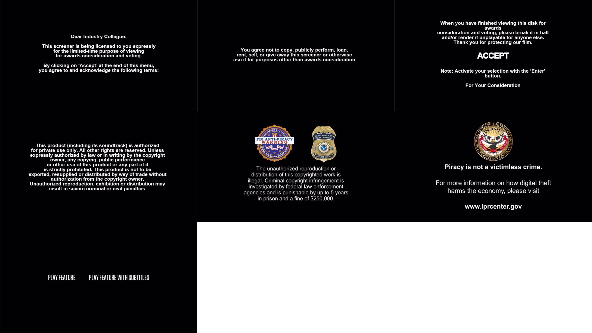
#CAPT# Images of all content before the film starts. Selecting the NO option returns DVDNAV_STOP, a command from the DVD letting the DVD player know to halt playback.
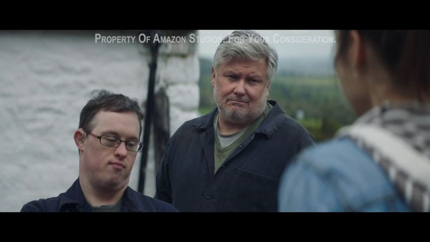
#CAPT# Screenshot of the watermark.
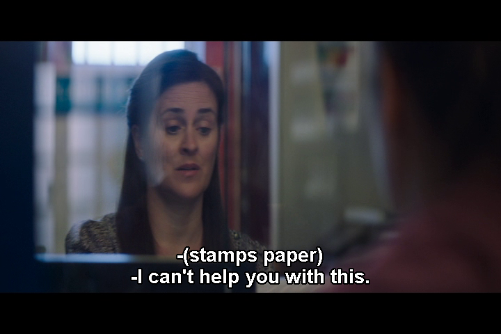
#CAPT# Screenshot of the subtitle programming. Other language subtitles use the same programming.

#PORD#

#DROP# 2018 - How To Train Your Dragon: The Hidden World - DreamWorks

### Intro: 
A screener for one of DreamWorks [later installments](https://www.imdb.com/title/tt2386490/) in the How To Train Your Dragon series. 

### Physical content: 

#### Case: 

Ships in a relatively standard foldout-style mailer case. Case feels constructed from cardboard.

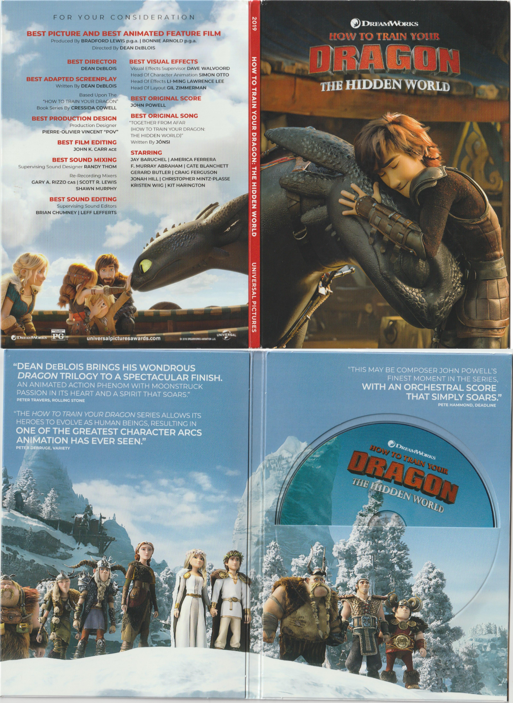
#CAPT# TOP: Exterior content of the case. BOTTOM: Inside content of the case. 

#### DVD: 

Branded DVD containing the film.

#IMGSML# HowToTrainYourDragonTheHiddenWorld/dvd.png

### Digital content:
File listing: 
```
├── AUDIO_TS
└── VIDEO_TS
    ├── VIDEO_TS.BUP
    ├── VIDEO_TS.IFO
    ├── VIDEO_TS.VOB
    ├── VTS_01_0.BUP
    ├── VTS_01_0.IFO
    ├── VTS_01_0.VOB
    ├── VTS_01_1.VOB
    ├── VTS_02_0.IFO
    ├── VTS_02_0.VOB
    ├── VTS_02_1.VOB
    ├── VTS_02_2.VOB
    ├── VTS_02_3.VOB
    ├── VTS_02_4.VOB
    ├── VTS_02_5.VOB
    └── VTS_02_6.VOB
```

Screenshots:

#CAPT# Images of all content before the film starts (3 images per row). Another disc destruction warning on 3rd screen.

#CAPT# Screenshot of the watermark.

#CAPT# Screenshot of the subtitle programming.

#PORD#

#DROP# 2017 - Call Me By Your Name - Sony Pictures Classics

### Intro:

This DVD contains the film [Call Me By Your Name](https://www.imdb.com/title/tt5726616/).

#### DVD:

A very to-the-point DVD with just the films logo and information on it.  

#IMGSML# CallMeByYourName/dvd.png

**Redacted content:**
1) Identifiable serial number/ID with barcode. 

### Digital content:

**File listing:**
```
├── AUDIO_TS
└── VIDEO_TS
    ├── VIDEO_TS.BUP
    ├── VIDEO_TS.IFO
    ├── VIDEO_TS.VOB
    ├── VTS_01_0.BUP
    ├── VTS_01_0.IFO
    ├── VTS_01_0.VOB
    ├── VTS_01_1.VOB
    ├── VTS_01_2.VOB
    ├── VTS_01_3.VOB
    ├── VTS_01_4.VOB
    ├── VTS_01_5.VOB
    ├── VTS_01_6.VOB
    └── VTS_01_7.VOB
```

**Screenshots:**
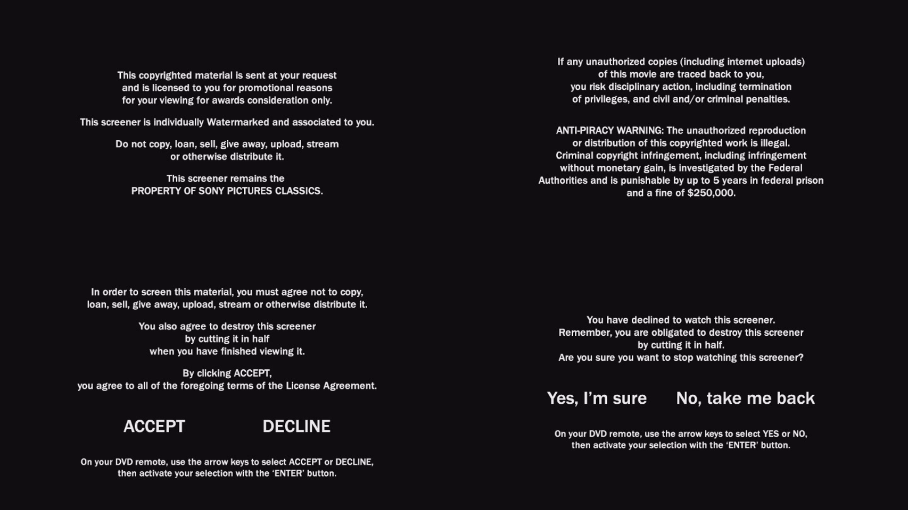
#CAPT# Images of all content before starting the film. When selecting the accept option, the film should begin to play, however DVDNAV would crash when selecting accept. Selecting the decline option shows the last picture. The "No, take me back" option returns you to the accept/decline screen, and selecting "Yes, I'm sure" will halt the DVD (DVDNAV_STOP). We were able to play the film by bypassing all menu options when playing the disc. 
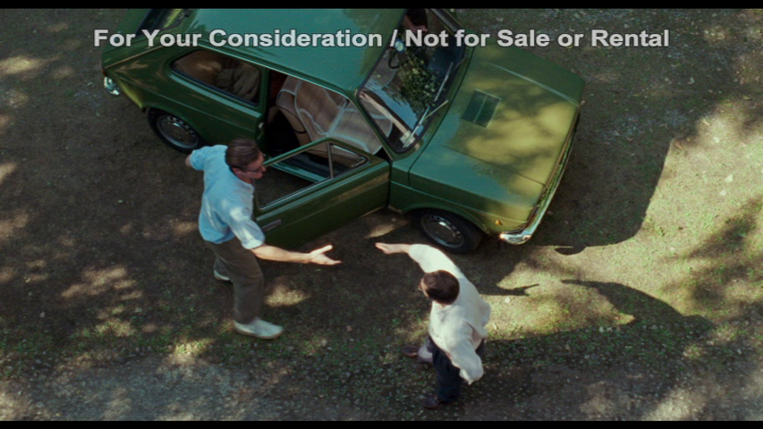
#CAPT# Screenshot of the watermark.
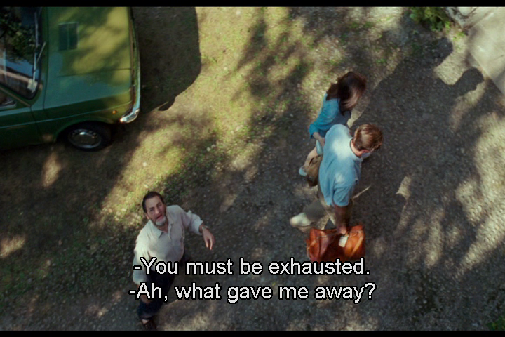
#CAPT# Screenshot of subtitle programming. This film also has burned-in subtitling for dialogue that is not English. 

#PORD#

#DROP# 2017 - The 3 Worlds of Gulliver Pre-Production Blu-ray - Powerhouse

### Intro:

Assumed to be a pre-production re-release of the [1960 film](https://www.imdb.com/title/tt0053882/) pressed to Blu-ray. Not really a screener but somehow I have it. 

### Physical contents: 

#### DVD:

#IMGSML# 3WorldsGulliver/dvd.png

**Redacted content:**
1) Text-based product code.
2) Day and month of creation date. Use unknown, could be linked back to individual pressings if limited.

### Digital content:

Screenshots: 
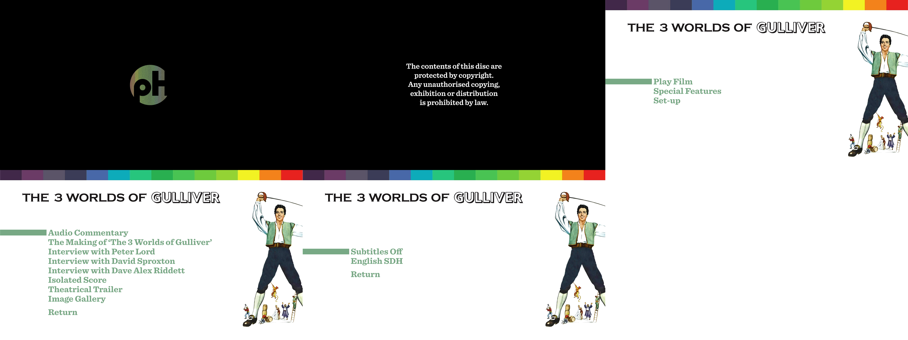
#CAPT# Images of all content before the film starts. The first image on row 2 is the special features, and the second image on row 2 is the setup menu.

#PORD#

#DROP# 2016 - Emmy Screener Set - Netflix

### Intro:

This thing was **infamous** during the awards season for the sheer size and weight of the set. It [made the news](https://www.independent.co.uk/arts-entertainment/tv/news/netflix-makes-a-statement-by-sending-emmy-voters-20-pounds-worth-of-screeners-a7068476.html), and weighed in at [over 20 pounds](https://static.independent.co.uk/s3fs-public/thumbnails/image/2016/06/07/08/emmys.jpg). Even more impressive is that guild members who received this behemoth never actually paid for it, they were shipped courtesy of Netflix for the award season. 

And I got one. 

I bought my unit still sealed in the plastic wrap, however I had to unseal it just to see what I was missing out on. Each box comes with a program card and the DVD booklets for each show and film. 

### Physical contents: 

#### Case: 

Box Photos: 


Program Card: 


#CAPT# Volume 1's program card included in the box. Other program cards wont be included as they are all completely identical (as shown previously). TOP: Front and back of card. BOTTOM: Inside of card.

Volume specific: 

#DROP# Volume 1
Dimensions: 
* Height: 6 1/2 inches.
* Width: 7 1/4 inches.
* Depth: 5 1/2 inches.

Case:

#CAPT# Scan of volume 1 box. In order: left side, front side, right side. The rear side of this box has nothing (white).
#PORD#

#DROP# Volume 2
Dimensions: 
* Height: 6 1/2 inches.
* Width: 7 1/4 inches.
* Depth: 3 inches. 

Case:

#CAPT# Scan of volume 2 box. In order: left side, front side, right side, back side.
#PORD#

#DROP# Volume 3
Dimensions: 
* Height: 6 1/2 inches.
* Width: 7 1/4 inches.
* Depth: 5 1/2 inches. 

Case:

#CAPT# Scan of volume 3 box. In order: left side, front side, right side, back side.
#PORD#

#DROP# Volume 4
Dimensions: 
* Height: 6 1/2 inches.
* Width: 7 1/4 inches.
* Depth: 3 inches. 

Case:

#CAPT# Scan of volume 4 box. In order: left side, front side, right side, back side.
#PORD#

### Subsequent Programs:

#DROP# Book 1/27: House of Cards
Nothing yet. 
#PORD# 

#DROP# Book 2/27: Longmire
Nothing yet
#PORD# 

#PORD# 

#DROP# 2016 - Manchester By The Sea - Amazon Studios

### Intro:

A screener for the film [Manchester By The Sea](https://www.imdb.com/title/tt4034228/) for the SAG-AFTRA awards consideration. I watched a bit of the film from the screener disc and its a very well-made film.

### Physical content: 

#### Case: 

Ships in a relatively standard foldout-style case. Case feels constructed from cardboard. 


#CAPT# TOP: Exterior content of the case that folds out. BOTTOM: Inside content of the case that folds out. 

#### DVD:

The disc itself is pretty much a standard Amazon issued disc. It contains none of the features branding or artwork. 

#IMGSML# ManchesterByTheSea2016SAGAFTA/dvd.png

**Redacted content:**
1) Identifiable serial number/ID with barcode. 

#### SAG-AFTRA Voting Card: 

This screener also contained a rather rare and interesting item, that being the SAG-AFTRA calling card still inside the screeners case.    


**Redacted content:**
1) Handwritten 7-character code, likely either a code to sign in digitally or tracking information.
2) ZIP code for recipient.
3) Intelligent mail barcode. 
4) Recipient name. 
5) Recipient address. 
6) Internal postal tracking codes. 

### Digital content:

File listing: 
```
├── AUDIO_TS
└── VIDEO_TS
    ├── VIDEO_TS.BUP
    ├── VIDEO_TS.IFO
    ├── VIDEO_TS.VOB
    ├── VTS_01_0.BUP
    ├── VTS_01_0.IFO
    ├── VTS_01_1.VOB
    ├── VTS_01_2.VOB
    ├── VTS_01_3.VOB
    ├── VTS_01_4.VOB
    └── VTS_01_5.VOB
```

Screenshots: 

#CAPT# Images of all content before the film starts (3 images per row). Notice how the 4th screen literally instructs the viewer to destroy the DVD when they are finished with it. 

#CAPT# Screenshot of the watermark.

#CAPT# Screenshot of the subtitle programming.

#PORD#

#DROP# 2015 - The Hateful Eight - The Weinstein Company

### Intro: 

Oscar-winning film [The Hateful Eight](https://www.imdb.com/title/tt3460252/) is a post-civil-war drama and thriller directed by Quentin Tarantino. 

One interesting fact about this film was that before it released, it [was reported to have leaked online](https://www.hollywoodreporter.com/movies/movie-news/hateful-eight-pirated-screener-traced-850899/) during awards consideration season by warez group `Hive-CM8`. The group claims the film was acquired by a street vendor at the time. 

### Physical content: 

#### Case: 

Ships in a very to-the-point case that holds the DVD. DVD label contains no special branding.

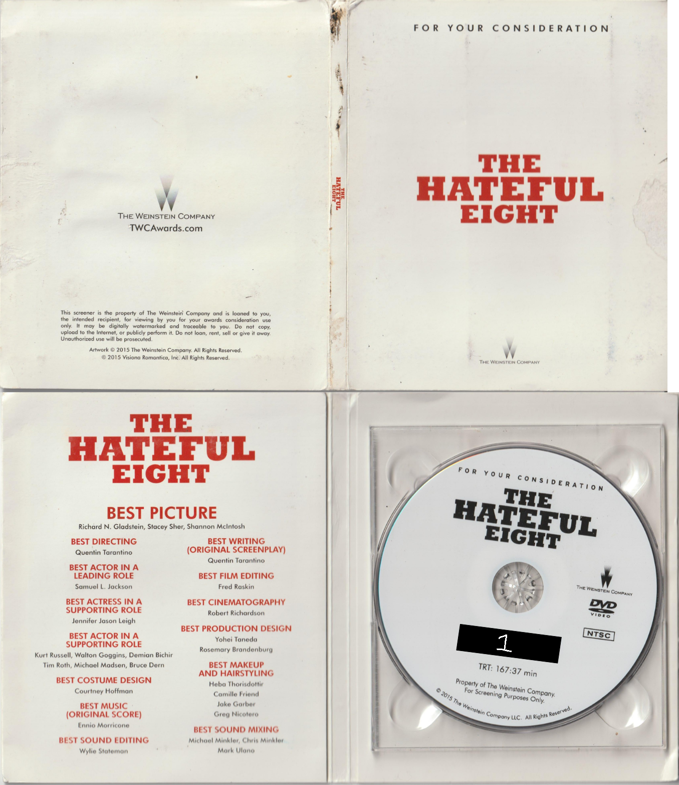
#CAPT# TOP: Exterior content of the case. BOTTOM: Inside content of the case, including DVD.

**Redacted content:**
1) Identifiable serial number/ID with barcode. 

### Digital content:

**File listing:**
```
├── AUDIO_TS
├── DISC.ID
└── VIDEO_TS
    ├── VIDEO_TS.BUP
    ├── VIDEO_TS.IFO
    ├── VIDEO_TS.VOB
    ├── VTS_01_0.BUP
    ├── VTS_01_0.IFO
    ├── VTS_01_1.VOB
    ├── VTS_01_2.VOB
    ├── VTS_01_3.VOB
    ├── VTS_01_4.VOB
    ├── VTS_01_5.VOB
    ├── VTS_01_6.VOB
    └── VTS_01_7.VOB
```

**What is `DISC.ID`?**

When I `cat` this file, it reveals a 15-character string. The first character is a lowercase letter, with the rest being numbers. This is most definitely a weak method of watermarking, however it does not exclude the fact that watermarking may be burned into the video and audio tracks. This is likely a deterrent to prevent copying, or a way to very quickly identify whose copy it is if someone gets lazy and uploads it without stripping the file out. The numbers in this string has no apparent correlation with the numbers printed on the DVD. 

**Screenshots:**
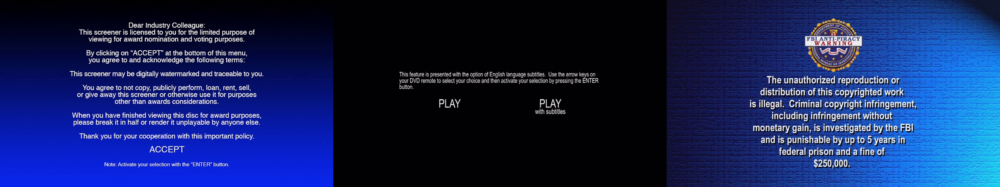
#CAPT# Images of all content before the film starts. 
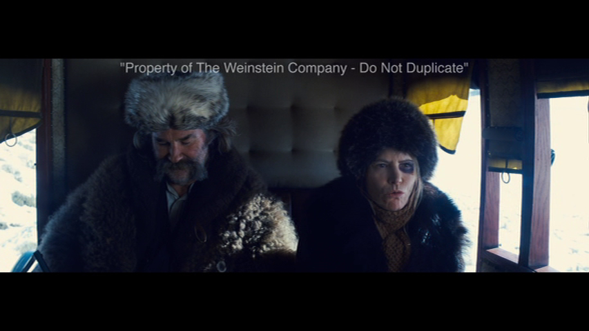
#CAPT# Screenshot of the watermark.
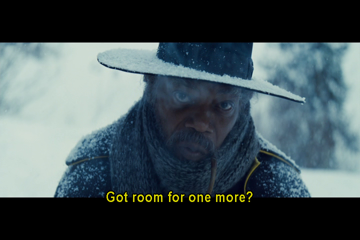
#CAPT# Screenshot of the subtitle programming.

#PORD#

#DROP# 2011 - Big Bang Theory - Warner Brothers

### Intro:

This DVD contains 2 episodes from the TV series [Big Bang Theory](https://www.imdb.com/title/tt0898266/). 

#### DVD:

A standard DVD with the features branding on it.  

#IMGSML# BigBang2011/dvd.png

### Digital content:

**File listing:**
```
├── AUDIO_TS
└── VIDEO_TS
    ├── VIDEO_TS.BUP
    ├── VIDEO_TS.IFO
    ├── VIDEO_TS.VOB
    ├── VTS_01_0.BUP
    ├── VTS_01_0.IFO
    ├── VTS_01_0.VOB
    ├── VTS_01_1.VOB
    ├── VTS_01_2.VOB
    ├── VTS_02_0.BUP
    ├── VTS_02_0.IFO
    ├── VTS_02_0.VOB
    ├── VTS_02_1.VOB
    └── VTS_02_2.VOB
```

**Screenshots:**
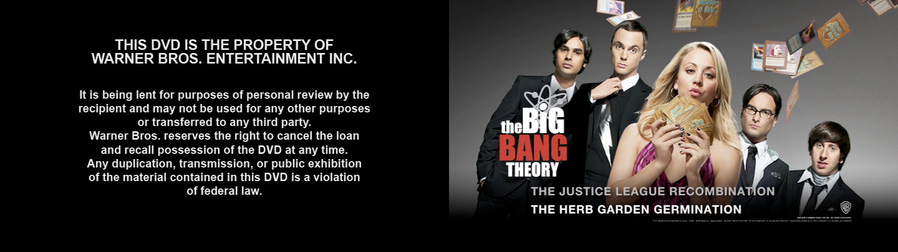
#CAPT# Images of all content before the episodes starts. 
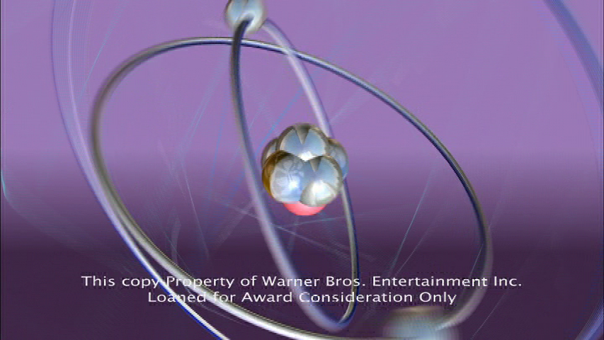
#CAPT# Screenshot of the watermark.

#PORD#

#DROP# 2003 - 24 - 20th Century Fox

### Intro:

[24](https://www.imdb.com/title/tt0285331/) is a show that literally lasts 24 hours (more like 18 without commercial breaks). Does that technically make it a livestream VOD?

#### Program Card: 

A paper program card outlining which episodes are on the disc and the people behind the show. 

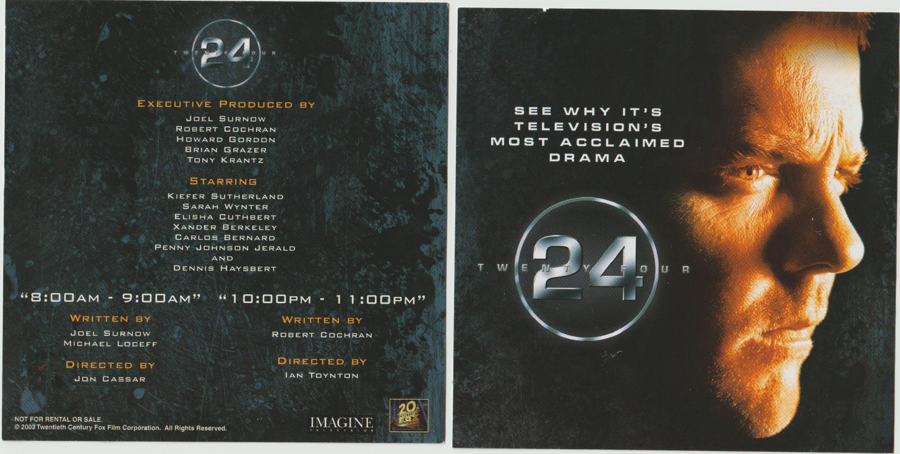

#### DVD:

A branded dvd featuring the shows promotional artwork and a lengthy warning.

#IMGSML# 24_2003/dvd.png

### Digital content:

**File listing:**
```
├── AUDIO_TS
└── VIDEO_TS
    ├── VIDEO_TS.BUP
    ├── VIDEO_TS.IFO
    ├── VIDEO_TS.VOB
    ├── VTS_01_0.BUP
    ├── VTS_01_0.IFO
    ├── VTS_01_0.VOB
    ├── VTS_01_1.VOB
    ├── VTS_01_2.VOB
    ├── VTS_01_3.VOB
    └── VTS_01_4.VOB
```

**Screenshots:**
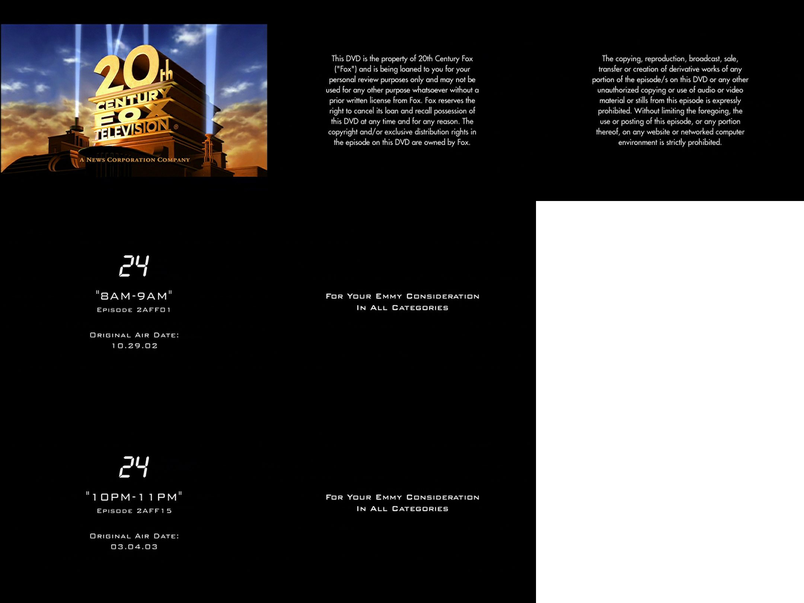
#CAPT# Images of all content before starting the film. The DVD boots directly into a video file containing all the preshow content and the episodes themselves. The last row plays halfway through the episodes as they remind the viewer which episode they are watching.
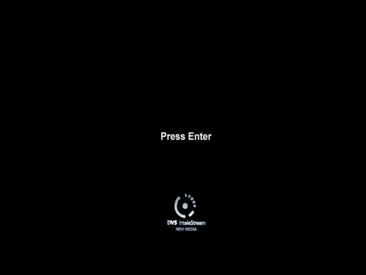
#CAPT# An odd screen that only appears at the end of the presentation instructing the viewer to press enter on their remote. Doing so just loops the video over again. Its likely this is some sort of DVD root menu that was never built or was a placeholder.
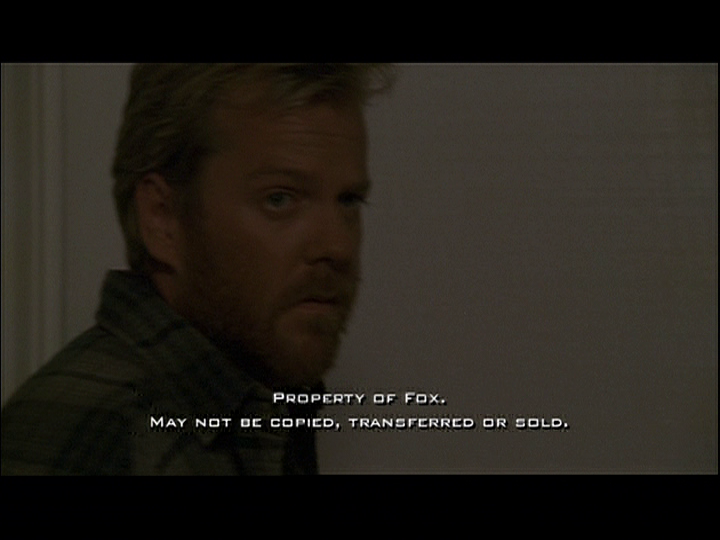
#CAPT# Screenshot of the watermark.

#PORD#

#DROP# 2003 - ER - Warner Brothers

### Intro:

[ER](https://www.imdb.com/title/tt0108757/) was a television medical drama that lasted from 1994 to 2009. It was very well received and was awarded many times during its time on the air. DVD's ship in a black plastic DVD case. While previewing the episodes I actually got hooked on the episodes across these discs, and the show is very well made. Turns out the covers can be very deceiving, as this show can get quite graphic despite the very heavenly-like white and black artwork printed on the front and back (which I should of seen coming for a medical drama). The labels on the discs themselves feels like its a sticker, not so much an actual professional print.

These 3 sets are from season 9. These screeners seem to have originally been VHS screeners copied to DVD, as the video contains VHS artifacts. What is also fascinating is that the episode "First Snowfall" appears on all 3 sets, which likely means the studio wanted to get as many eyes on this episode as possible. 

I found out the general set was named such from the DVD volume name. The name burned to the DVD was `ER_GENERAL`.

#DROP# Outstanding Performances Set

### Intro: 

These appear to be some of the most powerful and action-packed selections picked out for guild consideration.  

### Physical content: 

#### Case: 

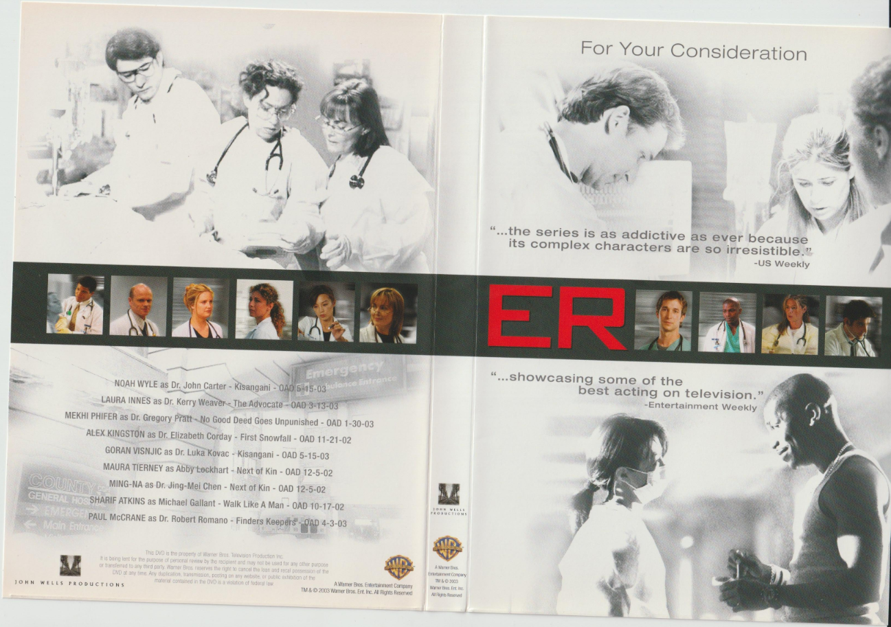

#### DVD:

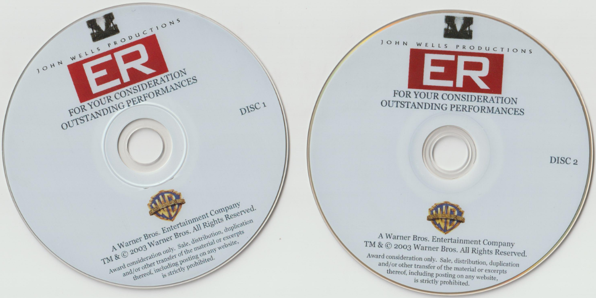

### Digital content:

#DROP# Disc 1

**File listing:**
```
├── AUDIO_TS
└── VIDEO_TS
    ├── VIDEO_TS.BUP
    ├── VIDEO_TS.IFO
    ├── VIDEO_TS.VOB
    ├── VTS_01_0.BUP
    ├── VTS_01_0.IFO
    ├── VTS_01_0.VOB
    ├── VTS_01_1.VOB
    ├── VTS_01_2.VOB
    ├── VTS_02_0.BUP
    ├── VTS_02_0.IFO
    ├── VTS_02_0.VOB
    ├── VTS_02_1.VOB
    ├── VTS_02_2.VOB
    ├── VTS_03_0.BUP
    ├── VTS_03_0.IFO
    ├── VTS_03_0.VOB
    ├── VTS_03_1.VOB
    ├── VTS_03_2.VOB
    ├── VTS_04_0.BUP
    ├── VTS_04_0.IFO
    ├── VTS_04_0.VOB
    └── VTS_04_1.VOB
```

**Screenshots:**
#IMGSML# ER2003/OutstandingPerformance/D1/preshow.png
#CAPT# Images of all content before either episode starts. The last 3 rows of images depend on which option was selected on the DVD menu. 

#PORD#

#DROP# Disc 2

**File listing:**
```
├── AUDIO_TS
└── VIDEO_TS
    ├── VIDEO_TS.BUP
    ├── VIDEO_TS.IFO
    ├── VIDEO_TS.VOB
    ├── VTS_01_0.BUP
    ├── VTS_01_0.IFO
    ├── VTS_01_0.VOB
    ├── VTS_01_1.VOB
    ├── VTS_02_0.BUP
    ├── VTS_02_0.IFO
    ├── VTS_02_0.VOB
    ├── VTS_02_1.VOB
    ├── VTS_02_2.VOB
    ├── VTS_03_0.BUP
    ├── VTS_03_0.IFO
    ├── VTS_03_0.VOB
    ├── VTS_03_1.VOB
    ├── VTS_03_2.VOB
    ├── VTS_04_0.BUP
    ├── VTS_04_0.IFO
    ├── VTS_04_0.VOB
    ├── VTS_04_1.VOB
    ├── VTS_04_2.VOB
    ├── VTS_05_0.BUP
    ├── VTS_05_0.IFO
    ├── VTS_05_0.VOB
    ├── VTS_05_1.VOB
    └── VTS_05_2.VOB
```

**Screenshots:**
#IMGSML# ER2003/OutstandingPerformance/D2/preshow.png
#CAPT# Images of all content before either episode starts. The last 4 images depend on which option was selected on the DVD menu. 

#PORD#

#PORD#

#DROP# Guest Performances Set

### Physical content: 

#### Case: 

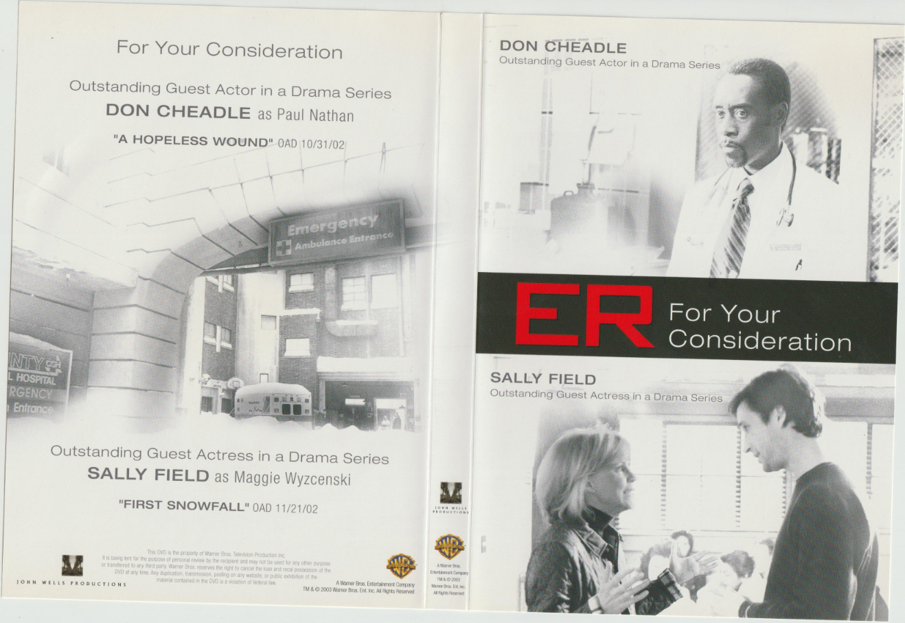

#### DVD:

#IMGSML# ER2003/GuestPerformance/dvd.png

### Digital content:

**File listing:**
```
├── AUDIO_TS
└── VIDEO_TS
    ├── VIDEO_TS.BUP
    ├── VIDEO_TS.IFO
    ├── VIDEO_TS.VOB
    ├── VTS_01_0.BUP
    ├── VTS_01_0.IFO
    ├── VTS_01_0.VOB
    ├── VTS_01_1.VOB
    ├── VTS_01_2.VOB
    ├── VTS_02_0.BUP
    ├── VTS_02_0.IFO
    ├── VTS_02_0.VOB
    ├── VTS_02_1.VOB
    ├── VTS_02_2.VOB
    ├── VTS_02_3.VOB
    ├── VTS_03_0.BUP
    ├── VTS_03_0.IFO
    ├── VTS_03_0.VOB
    └── VTS_03_1.VOB
```

**Screenshots:**
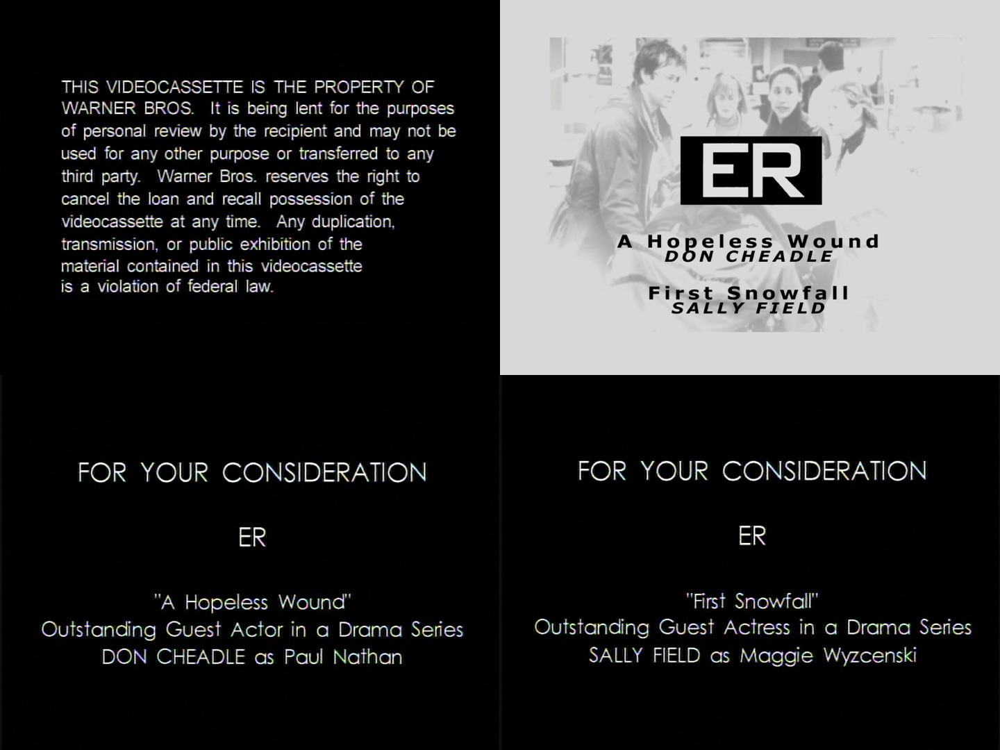
#CAPT# Images of all content before either episode starts. The last 2 images depend on which option was selected on the DVD menu. 

#PORD#

#DROP# General Set 

### Physical content: 

#### Case: 

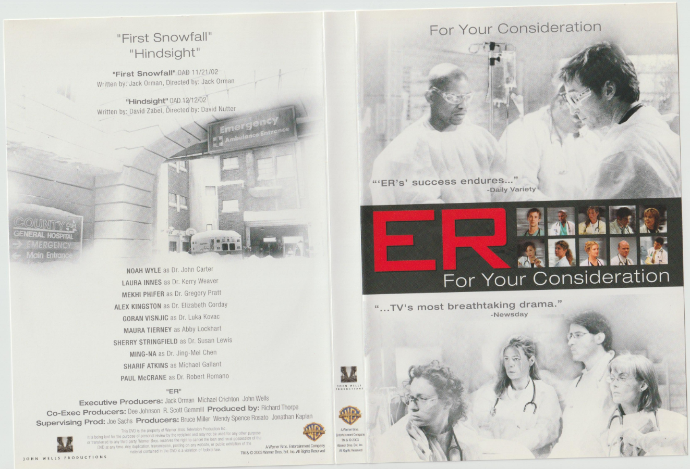

#### DVD:

#IMGSML# ER2003/General/dvd.png

### Digital content:

**File listing:**
```
├── AUDIO_TS
└── VIDEO_TS
    ├── VIDEO_TS.BUP
    ├── VIDEO_TS.IFO
    ├── VIDEO_TS.VOB
    ├── VTS_01_0.BUP
    ├── VTS_01_0.IFO
    ├── VTS_01_0.VOB
    ├── VTS_01_1.VOB
    ├── VTS_01_2.VOB
    ├── VTS_01_3.VOB
    ├── VTS_02_0.BUP
    ├── VTS_02_0.IFO
    ├── VTS_02_0.VOB
    ├── VTS_02_1.VOB
    ├── VTS_02_2.VOB
    ├── VTS_02_3.VOB
    ├── VTS_03_0.BUP
    ├── VTS_03_0.IFO
    ├── VTS_03_0.VOB
    └── VTS_03_1.VOB
```

**Screenshots:**
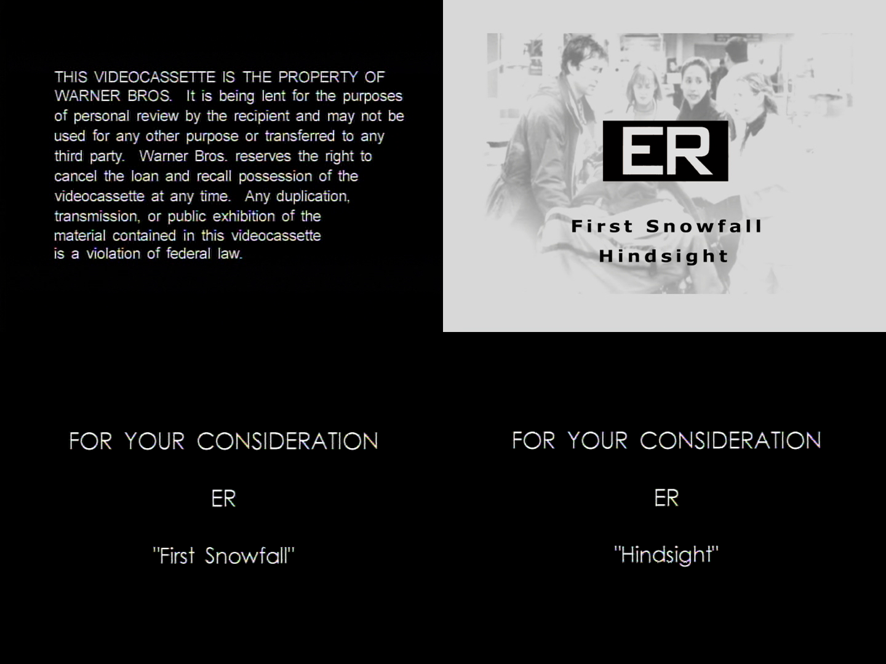
#CAPT# Images of all content before either episode starts. The last 2 images depend on which option was selected on the DVD menu.

#PORD#

#PORD#

#DROP# 2002 - Emmy Consideration Set - Discovery Channel

### Intro:

Set of content mailed to guild members from the Discovery Channel. Every program on inside this set is a documentary.

### Physical content: 

#### Case: 

Ships in a cardboard fold-out case. There is only 3 disc slots despite shipping with 4 discs, so disc 1 and 2 are in the same slot.

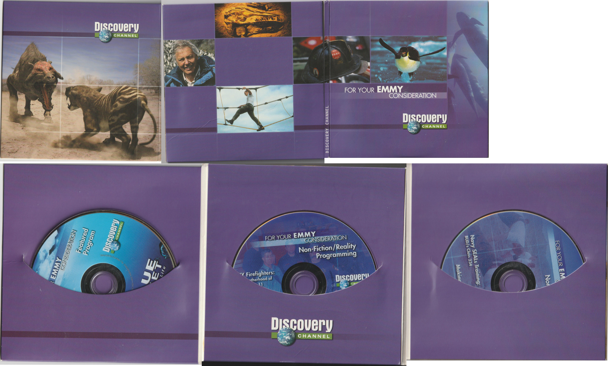
#CAPT# Top row is the exterior of the case, and  the bottom row is the interior.

#### DVD:

#IMGSML# DiscoveryChannel2002/dvd.png

#### Program Card: 

This card explains each program and which category they are eligible for. 


#CAPT# Each row represents each side of the foldout card.

### Digital content:

#DROP# Disc 1 - Featured Program (Blue Planet: Seas of Life)

**Intro:**

[The Blue Planet](https://www.imdb.com/title/tt0296310/) is a water-focused nature documentary series. This is a *nearly 5 hour* presentation with some very impressive videography for the time. 

**File listing:**
```
├── AUDIO_TS
└── VIDEO_TS
    ├── VIDEO_TS.BUP
    ├── VIDEO_TS.IFO
    ├── VTS_01_0.BUP
    ├── VTS_01_0.IFO
    ├── VTS_01_0.VOB
    ├── VTS_01_1.VOB
    ├── VTS_01_2.VOB
    ├── VTS_01_3.VOB
    ├── VTS_01_4.VOB
    ├── VTS_01_5.VOB
    ├── VTS_01_6.VOB
    ├── VTS_01_7.VOB
    └── VTS_01_8.VOB
```

**Screenshots:**
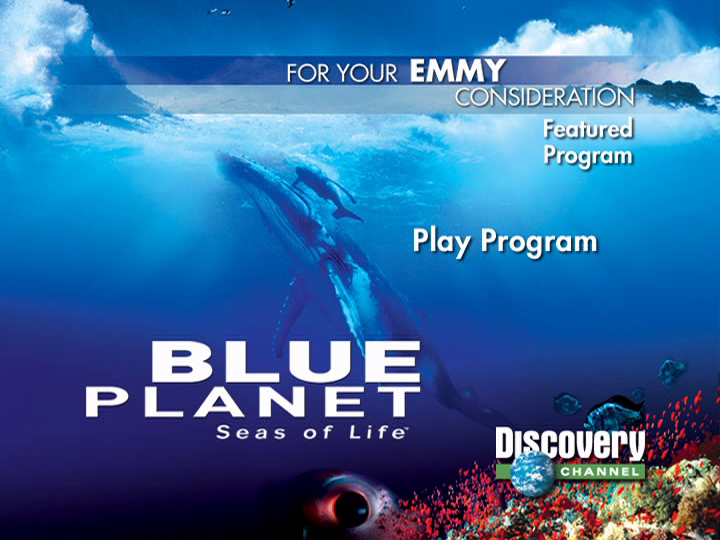
#CAPT# Disc directly loads into this DVD menu. Videos immediately play when feature is selected. 

#PORD#

#DROP# Disc 2 - Animated Programming

**File listing:**
```
├── AUDIO_TS
└── VIDEO_TS
    ├── VIDEO_TS.BUP
    ├── VIDEO_TS.IFO
    ├── VTS_01_0.BUP
    ├── VTS_01_0.IFO
    ├── VTS_01_0.VOB
    ├── VTS_01_1.VOB
    ├── VTS_01_2.VOB
    ├── VTS_01_3.VOB
    ├── VTS_01_4.VOB
    ├── VTS_01_5.VOB
    ├── VTS_01_6.VOB
    ├── VTS_01_7.VOB
    └── VTS_01_8.VOB
```

**Screenshots:**
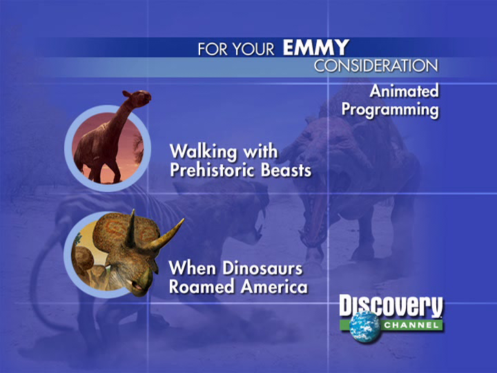
#CAPT# Disc directly loads into this DVD menu. Videos immediately play when feature is selected. 

#PORD#

#DROP# Disc 3 - Non-fiction/Reality Programming 1

**File listing:**
```
├── AUDIO_TS
└── VIDEO_TS
    ├── VIDEO_TS.BUP
    ├── VIDEO_TS.IFO
    ├── VTS_01_0.BUP
    ├── VTS_01_0.IFO
    ├── VTS_01_0.VOB
    ├── VTS_01_1.VOB
    ├── VTS_01_2.VOB
    ├── VTS_01_3.VOB
    ├── VTS_01_4.VOB
    ├── VTS_01_5.VOB
    ├── VTS_01_6.VOB
    ├── VTS_01_7.VOB
    └── VTS_01_8.VOB
```

**Screenshots:**
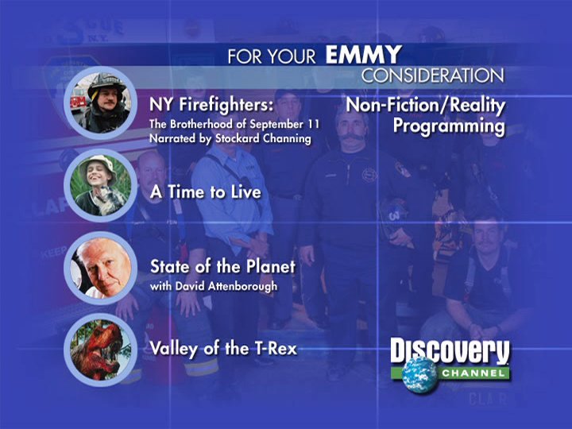
#CAPT# Disc directly loads into this DVD menu. Videos immediately play when feature is selected. 

#PORD#

#DROP# Disc 4 - Non-fiction/Reality Programming 2

**File listing:**
```
├── AUDIO_TS
└── VIDEO_TS
    ├── VIDEO_TS.BUP
    ├── VIDEO_TS.IFO
    ├── VTS_01_0.BUP
    ├── VTS_01_0.IFO
    ├── VTS_01_0.VOB
    ├── VTS_01_1.VOB
    ├── VTS_01_2.VOB
    ├── VTS_01_3.VOB
    ├── VTS_01_4.VOB
    ├── VTS_01_5.VOB
    ├── VTS_01_6.VOB
    ├── VTS_01_7.VOB
    └── VTS_01_8.VOB
```

**Screenshots:**
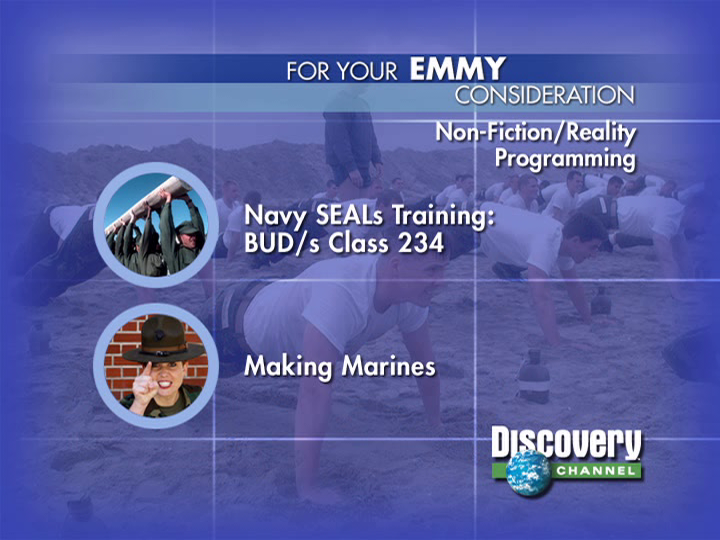
#CAPT# Disc directly loads into this DVD menu. Videos immediately play when feature is selected. 

#PORD#

#PORD# 

#DROP# Template

### Intro:

I am an intro with an [IMDB](https://www.imdb.com/title/tt5726616/) link.

#### Case: 

Just a case.


#CAPT# TOP: Exterior content of the case. BOTTOM: Inside content of the case. 

#### DVD:

A dvd.

#IMGSML# FOLDER/dvd.png

**Redacted content:**
1) Redacted stuff

### Digital content:

**File listing:**
```
TREE output here
```

**Screenshots:**

#CAPT# Images of all content before starting the film. 

#CAPT# Screenshot of the watermark.

#CAPT# Screenshot of subtitle programming. This film also has burned-in subtitling for dialogue that is not English. 

#PORD#