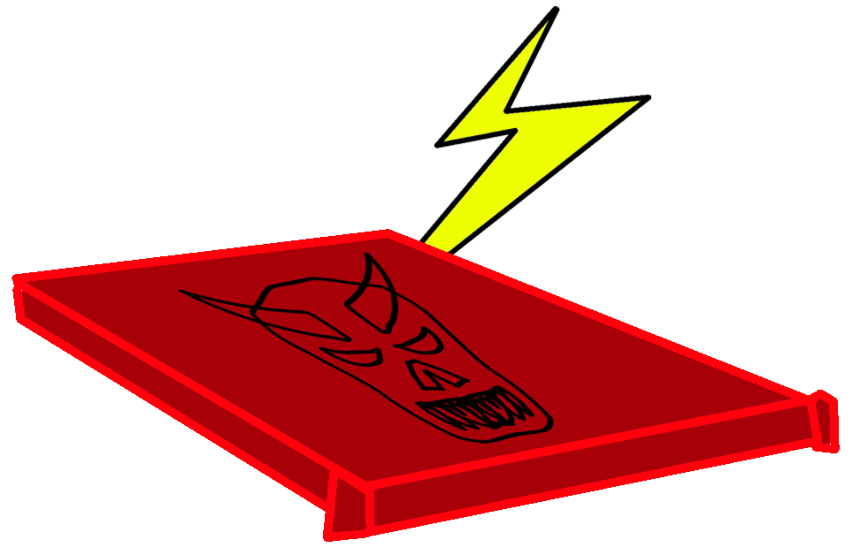
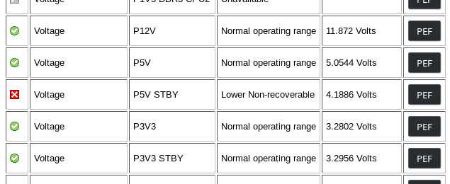
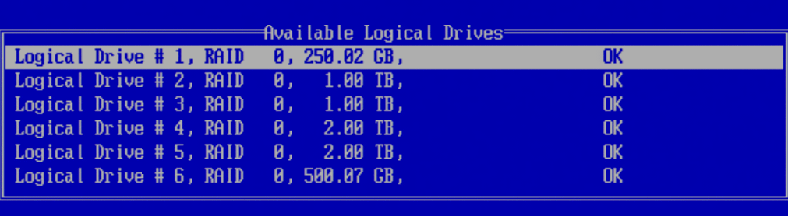
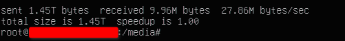
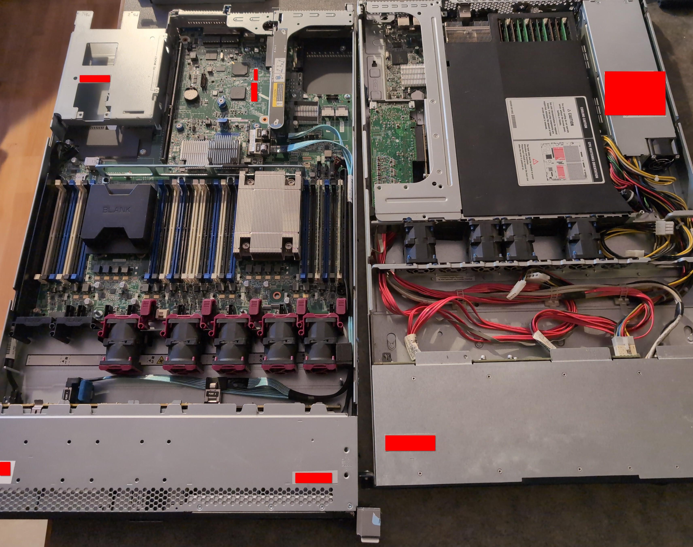
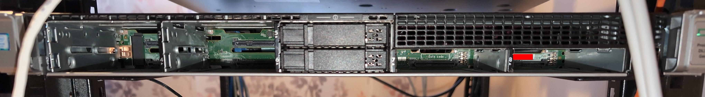

!# Day the NAS Died

!## Published: August 25th, 2026

#TOC#

## What happened

In a cold December morning during 2025 I woke up and noticed that I could hear the low hum of server fans spinning from my room. Normally I should not be able to hear the fans at that distance, so this was not normal, and as such I went to the rack and discovered that the loud noise was originating from the NAS. After investigating further, I found that the fans were ramped up to maximum speed. 

Before heading to work, I performed some quick troubleshooting to get insight into what was going on. The first thing I did was pull out the KVM console and login to the server. When connecting to the device, the display was showing nothing, and the server had completely locked up (no response to keystrokes). I verified the connections on the KVM console and confirmed again that the server had locked up. 

Before I left for work, I made sure to leave the system powered down and unplugged, as I had already assumed that hardware had failed and didn't want to risk damaging the storage or components inside. 

When I got home, I immediately performed an investigation as to why this occurred. The first thing I did was remove all the storage drives and place them into a box, before placing them into a secure location. I then moved the server to a different PDU. This would last a bit longer, with the screen flickering on and showing the boot splash; however, the screen went black, and the fans ramped back up to full power. After powering off the server, the server would no longer turn back on when the power button was pressed. 

After this, I noticed that the NIC was still active on the system even when it was powered off, and I logged into the [iLO portal](https://en.wikipedia.org/wiki/HPE_Integrated_Lights-Out) on the system. When checking the hardware sensors, an entry for “P5V STBY” was marked as Lower Non-Recoverable. 

The next thing I did was un-rack and take the server apart to inspect it for any apparent damage, especially around the power supply area. After an inspection, nothing looked burnt or wrong on any of the boards; however, after some more testing, the system was starting to exhibit extremely odd behavior such as turning itself off after a few seconds. At this point I have come to the conclusion that it's highly likely that the power supply is completely shot. 

## The Perfect Disaster

This has not been explained in my homelab writeup, but someone could have easily recognized a major flaw that I realized when this happened. If it was not obvious, the primary flaw is that I did not have any form of true backup. The drives housing data do copy over weekly on the server in case one of the drives dies, however there is no offsite or local backup. All data sits on that single server. 

To add to that, we were using mixed drive types for storing data. The drives hosting the files on the NAS are SSDs, and on a weekly basis, a delta sync initiated by [GABS](https://github.com/glob-bruh/GBAutoBackupSystem) is made between the SSD and HDD, checking for any new, updated, or deleted files. The data on the HDD is then updated to reflect the current version of the data on the SSD. The reason why we had to do this is because the HP RAID card does not support RAID arrays using mixed-drive types. There was also no way to pass through the drives directly on this server, so we resorted to configuring each drive in its own RAID 0 logical array. However, this came with a cost: we would no longer be able to easily access the data on a single drive by inserting it into another system, as we would be placing all data under a proprietary RAID format from HP. 

This alone was what turned the whole event from a simple PSU failure into a disaster recovery situation. Should anything go wrong during the investigation and recovery of the NAS, we could end up **losing unrecoverable data**. As such, this incident needed to be dealt with the utmost care. 

The first thing to do was what I usually do when dealing with someone potentially catastrophic: take a step back, look at it, and begin processing a plan of action. After spending a bit of time thinking the situation over and planning out an approach, I determined the following is the best way to move forward: 

1) Get the data off and ensure it is secured no matter what. 
2) Assess repair costs, source components, and purchase hardware. 
3) Get the new server online by restoring configurations and data. 

## Saving the Data

(AKA [Livin’ on a Prayer](https://youtu.be/lDK9QqIzhwk?t=159))

The first step was to get the data on the server off and verify that no damage has occurred. As mentioned previously, the difficulty of this was exacerbated due to the logical arrays that the drives were configured in on the server. At the moment, there was no way to take data off the server without resorting to using external hardware that I did not have at the time (I had tried mounting it in another system but as expected this did not work). Without any way to access the drives contents, our progress had grinded to a halt. 

Immediately the first thing I did was go and purchase an external hard drive to back up the data onto. I did not want to risk purchasing and using a used storage device, and since we want to encompass all data, no questions asked, I assessed the space needed based on the drive sizes rather than their usage. 

The server (without cloned drives) had a 1TB drive for NAS data, then a 2TB drive for NAS data. There was an extra (un-cloned/hot) 500GB “Public Share” drive, then a 250GB boot drive that contained the operating system. The boot drive was disposable as all important configurations on the system were redirected to the NAS drives and locked down, which means they were also automatically replicated to the other HDD drive. After heading on Amazon and checking out the Christmas tech deals, I purchased a [Western Digital 12TB Elements external hard drive (model WDBWLG0120HBK-NESN)](https://www.amazon.ca/Western-Digital-Elements-Desktop-Drive/dp/B07X4V2M3B) for almost half of its original price (this thing goes for $734.99 CAD regular and my total came out to $320.74 CAD). 

While waiting for the external drive to ship, the next step was to assess the damage towards the server. From an unplugged state, the server would turn on, and it would sound like a normal boot sequence, then the fans would go to full power, and the screen would remain black. After forcing the server off by holding the power button (or forcing it to power off in iLO), it would no longer turn on. The power button was still amber and the NIC’s/iLO were still active, however the server would refuse to power on unless it was unplugged and re-plugged, in which case this same procedure would occur again. The server also only had 1 PSU (not 2 for redundancy), so the NAS was fully offline with no other way to power it. 

Knowing that I am in a position where I am stranded, there was only one other thing I could do. I phoned a friend, and they were able to deliver a same generation 2U HP server that had close to the same firmware as my NAS hardware. This would give me a fully functional system to swap parts and work with while troubleshooting. 

After the external USB drive had arrived, I had setup the loaner server by sliding in the boot drive into its appropriate bay. Since I was moving from a 1U server to a 2U server, the backplane layout has changed. Instead of 2 rows of drives with 4 then 7 bays, the 2U server has 4 rows of bays with only 2 bays in each row. Luckily, I had put labels on each drive earlier to let me know which bay each drive goes in. I had tried numerous things with only using the boot drive as I did not want to endanger the data drives, however nothing worked (including placing the card from the 1U server into the loaner server and using the backplane from the old server). After some time, we had decided to do a final test, and slot in every drive from the old NAS into the loaner system since the RAID card firmware between the dead NAS and loaner server is nearly identical. Eventually, after plunging the drives in, I saw this:

The RAID 0 arrays of drives in the NAS were being detected on this new server. Turns out that to use a logical array, you must have ALL drives connected to the system, or else the array will not appear. 

After setting up the boot order in the BIOS and selecting a logical drive as the boot drive in the RAID card, I rebooted the system and saw the GRUB menu. After booting into Linux and getting logged in, I ran a directory listing on the NAS directory that the drives were mounted in (existing [FSTAB](https://wiki.debian.org/fstab) configuration auto-mounted NAS drives), and everything looked fine. After ensuring that all the data looked good, I then needed to back up everything on this system to the external hard drive. This was performed by plugging in the external hard drive to the rear USB port, then formatting the drive to a compatible format, then mounting it in Linux. I then fired up [TMUX](https://www.redhat.com/en/blog/introduction-tmux-linux) and initiated a full copy as superuser in one pane using [RSYNC](https://en.wikipedia.org/wiki/Rsync) and left an open shell in another pane so that I could check disk space and files during the copy. I made sure once more that everything was copying over fine, then went to bed. 

#IMGSML# databackup.jpg
#CAPT# Blurry picture of the loaner server performing backup operation to external HDD from the NAS drives. 

The next day I took a look at the server performing the backup, and it had finished the transfer overnight. I was now in possession of a complete offline backup of all data on the NAS, which meant that even if I did lose the data on the current drives, I would not be completely out of luck. Afterwords, I made sure to plug the external drive in a separate computer and copy a couple of test files off to ensure that the backup procedure had worked. 

#CAPT# Terminal showing that all the data had been transferred from disks to external HDD.

## Shopping for a Solution

I had initially investigated replacing the server’s power supply, however after assessing resellers that are both HP partners and the used market, the cost of replacing the power supply would total about the same as replacing the entire server. As such, I determined that a full server replacement would be a better course of action, and this decision would also lead to getting a newer platform from the new server. 

When looking for home lab equipment, I usually turn to a few sources, both IRL and online. In short, my IRL contacts did not have any replacement units, and the online communities I was looking at also did not have any servers available for purchase. 

Since I could not find anything through my regular contacts, I then turned to a semi-local organization that focuses on reselling retired equipment for a new server that can operate as a replacement for the NAS. After comparing options, I settled on a HP DL360 G9 server. The CPU specification was quite low; however, a friend was able to provide more powerful, compatible CPUs. This server was also 1U and had something the last server didn't: dual power supplies. After unboxing the device, I noticed that despite the photo on the listing, the server was missing all its drive caddies except for 2 blanks. We could not use the old drive caddies as they were far thicker than these new ones. This was promptly resolved after contacting the seller, and they immediately shipped the correct quantity of drive caddies. 

#CAPT# Picture of the new server and the old server. The new server is on the left, and the old server is on the right. 

#CAPT# New server racked as shipped with missing drive caddies. 

The old NAS had exuberant amounts of DDR3 memory that will be reused on the VM servers. Its drive bays have also been salvaged as quick replacements to the VM server bays. This is because the old NAS server and VM servers are from the same HP server generation. 

## New NAS Deployment

One of the key features of this new server was that its RAID controller included something very valuable: HBA mode. This feature allows us to directly pass the drives through the controller, directly into the operating system, completely removing the need for the previous workaround method when working with mixed drive types (making multiple RAID 0 arrays for each drive). 

Since we had a working external backup on the 12TB drive at this point, we felt far safer messing around with the drives. After installing the old physical drives into the new server (and reseating the backplane cables), it detected that a RAID configuration was already present on the disks, though not usable. We decided to clear the RAID configuration on all drives, then decided to enable HBA mode on the card without reformatting any drives.

When reinstalling the OS, we decided to use Debain 13, as it's the latest version. We also moved away from the previous SFTP setup and installed SAMBA, as it has better cross-platform interconnectivity and is highly recommended for use on storage servers. 

After installing and logging into the fresh installation of Debian, we restored the [FSTAB](https://wiki.debian.org/fstab) configuration. Upon doing so, we noticed that there was already data in the NAS data paths, and upon deeper inspection, realized that every file was still there. After researching, clearing the RAID configuration never destroyed data; something only possible on single-drive RAID 0 arrays. Clearing the RAID configuration exposed the disk’s raw filesystem, which after enabling HBA mode, the OS was then able to read. While very unexpected, this saved us from having to spend time performing a restore of all the data.  

Knowing that the data has been restored, we proceeded to symlink our configurations back to their intended locations on the OS (such as SSH configuration files). After that, the SAMBA service was configured for the first time, and after starting it, the server was fully restored and ready for use. 

## Learning from Mistakes

As with any disaster situation that has occurred, postmortem is just as important as the recovery itself. The biggest problem here was the lack of a dedicated backup system to avoid data loss in the event of complete system failure. Downtime for a NAS is not necessarily a concern for the homelab, but ensuring that the data stays safe on it is. 

I had considered the possibility of using cloud storage for backing up (such as Microsoft Azure), however the largest issue we had is that we can't physically access that data, nor necessarily see where exactly it's stored, and we would rather not take risks with losing access over account closures or missing payments. This option is not completely out of the picture, but we would much rather use physical hardware we can control. 

I have met with a friend who is experienced in high-performance IT infrastructure in a local mall to discuss this specific incident with them. I ran through the series of events and complications that I had explained throughout this post. We recognized that this could have been avoiding this with a backup system that I could restore from without worrying about the proprietary RAID system the HP RAID card uses. After listening to my backup grievances, they have explained that they do have a spare server but that drives would need to be provided. We had a further discussion about creating a VPN site-to-site tunnel on a segmented network in their place to facilitate backup operations, as well as discussing cost agreements for running the backup. 

Along with the idea of off-site backups, I have been planning local redundant storage using a secondary server that syncs with the primary server. This plan is already similar to another high-availability strategy we have been looking to implement with our VM hosts. Any future updates regarding backup servers will either become its own blog post or be written into the homelab writeup. 

The morale here is to **ALWAYS HAVE A BACKUP** and to always remember the [3-2-1 rule](https://www.veeam.com/blog/321-backup-rule.html)! Again, If I had a local backup of all the data on a separate system (or an off-site backup), getting back up and running would have been a matter of yanking the old server and dropping in the new one seamlessly without worrying about data loss. All it would take is a reinstall and re-sync. 

## Why publish your failures?

In my opinion, the best way to learn (especially in information technology spaces) is through failure. Without failure, it is impossible to make improvements or innovations. A good example of learning through failures is the infamous Cisco [power button field notice](https://www.cisco.com/c/en/us/support/docs/field-notices/636/fn63697.html), where an ethernet cables protective boot will hold down the switches power button when plugged in and result in the startup configuration being cleared. This is clearly something nobody could have really seen coming as it's quite a rare scenario, but clearly this has caused grief for technicians that would need to drive out to locations and cut the boot off their cables. Cisco (and other networking vendors) has learned from this mistake and now ensures the power button is located at a safe spot when designing new equipment. 

Publishing your mishaps also establishes that nothing (and nobody) is perfect; sometimes things are simply not as clean or easy as they look. Research is also paramount to helping other people resolve issues they may be facing as well. Perhaps one day someone will encounter the same issue I had where all their drives are set to a proprietary RAID 0 on an HP ProLiant and are curious if swapping the drives into a same-gen system works. Perhaps someone might just be interested in homelab disaster recovery and wonder how much it differs from actual enterprise-scale disaster recovery. 

These reasons are exactly why publishing failures are good for the broader information technology community. I made a mistake that produced real consequences, so you don't have to (and if you do, then you can read about how I approached the situation). 