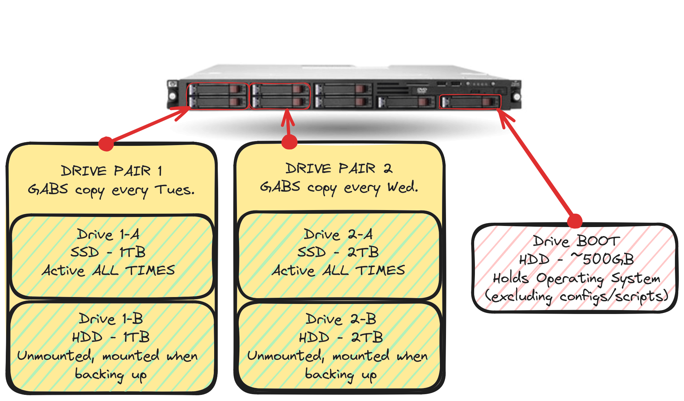

!# Homelab Writeup

!## Published: September 3rd, 2024 /// Last Edited: December 7th, 2024

## What is a "Homelab"?

A homelab (aka a home server) is exactly as it sounds: a technology laboratory for home. Most homelabs will consist of switches, routers, and servers, however some might be more unique in that they feature custom hardware or have completely different setups altogether (like VoIP or PBX homelabs for testing phone systems).

A really good place to explore other homelab setups is by visiting [r/homelab on Reddit](https://www.reddit.com/r/homelab/). There you will find anything from Ubiquiti racks costing thousands, to mobile servers with portable routers strapped on mini-computers.

## The History

Believe it or not, the first homelab I had was an old Huawei Ascend cell phone with an app that worked as a file server, and a tiny Dlink router. The cell phone connected to the router over WiFi. It worked fine, but wasn't anything special.

After some time the homelab was upgraded. Now it ran a Raspberry Pi 3 microcomputer (running the default Raspberry Pi operating system, Raspbien) and used a Linksys WRT54GS router to run the entire network. The Raspberry Pi ran a FTP server that pointed to an external 1TB USB HDD. Also, this time the Raspberry Pi was connected over a cat-5 cable instead of WiFi.

Eventually I found someone who sold and traded enterprise-grade gear, and over time I purchased a Cisco 24 port SF300 small business switch and 2 HP desktop towers from them. One of the towers would be a NAS that ran Debian, while the other was frequently wiped for other projects. One of the projects I remember lasting a little longer was using it as a Kali Linux machine that I could remote into, as I was learning pentesting at the time. Eventually I received an old Dell Optiplex, and that would become the new Kali Linux machine while the other HP desktop would remain a project box.

#CAPT# A picture of one of the HP systems with a keyboard and cat-5 cable.

During this time I have also purchased an Cisco 48 port SF300 small business switch that I would swap out the 24 port with. The 24 port switch had its configuration wiped and was temporarily used for another project.

At this point, the router that was currently running the entire network was a Linksys WRT160N router, and because I wanted to learn more about Cisco equipment, I purchased a used Cisco 2911 enterprise router for an extremely reasonable price off the internet. The router also shipped with 2 VoIP cards installed (that I used as glorified port covers at the time), and would replace the aforementioned Linksys router.

#CAPT# The Cisco 2911 with the Cisco SF300-48. You can just see the FTP server on the right.

With some downtime I also made a temporary VHS archival station with a General Electric VHS player, an RCA to HDMI converter, and a small cheap USB HDMI capture card. This archive station has long been shut down though.

I would also later upgrade my personal rig from an Acer Nitro 5 laptop to a full blown desktop. The aforementioned laptop would become an on-the-go system with triple boot (Windows/Debian XFCE/Kali Linux). The Linux distros on the laptop are fully encrypted, and the drive was upgraded from an HDD to an SSD for when me and friends play Jackbox Party Pack (a computer party game).

After some time, I would purchase an 1U HP server from the same aforementioned person, and it would sit in storage until I was able to purchase some drives for it. The reason it was being sold was because 1U devices are too loud for their environment, but I found most of the noise to come from the startup sequence. When I did get drives (1 SSD and 1 HDD), the system was set up with Debian XFCE on the SSD with an FTP and VPN server. This will be covered more later.

I would also swap out the Cisco SF300 with a Cisco Catalyst 3750-XT as I was more familiar with that switch, and it also had various other features that the old switch did not have.

#CAPT# Photo of the setup right before rack deployment, cabling disaster included. And yes, the switch and server is sitting on cable boxes.

I was still running all this equipment on top of cable boxes on a floor, and I would eventually make some money and was able to purchase some really useful equipment:

* A 24 unit (24U) metal equipment rack.
* 2 Cyberpower PDU's.
* A 2TB SSD and a 2TB HDD.
* Rack Shelves for the 1U HP server (as the HP server does not have rails to sit on).

Throughout the course of a weekend, all the equipment was cleaned, assembled, and racked. Some devices simply couldn't be racked (due to weight or size problems) and would sit on a piece of cut plywood on the bottom.

#IMGSML# lab20231001.jpg
#CAPT# The rack, in the middle of the night, right after being built.

More recently. I would purchase 2 2U Hewlett-Packard ProLiant DL385 G7's from the tech trader, with 128GB of memory each. These 2 systems would become VM systems, one with the focus on public-use systems and one with personal systems for projects. The public server will not host servers for personal use that are forwarded to the internet, such as a private Minecraft server. I would also purchase drive caddies for these servers, as it only came with 2 blanks/covers each.

The rack would then move to a new location. During this move the 2 VM servers would be put into the rack.

## Breakdown of the Homelab

#IMGTWOR# currentPic1.jpg,currentPic2.jpg
#CAPT# The homelab in its current state. More recently I organized the power cables to go into the right side of the rack (similarly to how the ethernet cables are routed).

### Power

Power is distributed from 2 15 amp wall outlets into 2 CyberPower PDU's. Devices are split over each PDU.

I would get a UPS for power outages, however not only is it pricey, but given the fact that most UPS's use large batteries we also want to ensure the setup is completely safe before doing so.

### Modem/Internet

Telus (by default for being an home subscriber) will give you an Actiontec T3200M for your modem. Shaw/Rogers will give you an Arris SBG6782 for being a home subscriber but I moved out of the Shaw/Rogers environment.

The modem has had most of its actual routing turned off. The only thing it really does is show us if the line out of the house works and keeps a static address for the Cisco router.

### Routers

The network currently only has 1 router, that being the aforementioned Cisco 2911.

More recently the VoIP cards have been swapped out for 1GB SFP cards, and currently a SFP connection from the modems SFP port to the routers SFP card is made to send all traffic to the internet. This is done with an SFP cable. I would do this from the router to the C3750-XT but the switch would refuse the SFP cable even when forced to allow 3rd party accessories.

The router currently runs multiple DHCP servers for each VLAN. Each VLAN is segmented by ACL's to prevent traffic from traveling between networks that it shouldn't. The following networks are included:

#NOTE# This is not a comprehensive list of every VLAN in my network. Some have been excluded for security purposes. 

* **Primary:** The private LAN that everyone uses.
* **Work:** Work network that is dedicated to workstations and devices that are for work.
* **Public:** This network is for the public server, as that server is designed to run VM's that are forwarded to the internet.

I also possess a Fortigate firewall but it is not deployed at this time.

### Switches

The switch that powers the entire network is the Cisco Catalyst 3750-XT. This is referred to as the “core” switch.

One of the switches that is deployed is an 8 port unmanaged gigabit Dlink switch that sits on my desk. This is so I can plug devices on my desk (like my PC) into the network rather than run a cable to another switch or the rack itself.

VLANS are programmed on every managed switch in the network using Cisco recommended procedure. Trunking is enabled on interfaces that require it, and all ports are configured to only allow use over a single VLAN. There is an unmanaged switch on my desk that cannot be programmed to use a specific VLAN, but it has select networks authorized for use, and my computer is programmed with multiple virtual interfaces to utilize those VLAN's. An native VLAN is also specified in-case im setting up something on my desk and need to get online.

### Servers

#### Server A - NAS

This is a 1U Hewlett-Packard ProLiant DL165 G7. It has become a bare-metal server with the sole intention to be an networked-attached storage server. The server has about 40GB of RAM, and a combined amount of 6TB of storage (excluding boot drive). The 6TB of total storage is really only 3TB of actual storage because the other 3TB is used as backup.

The boot drive is a random 225GB HDD that runs the operating system. The drives are added to the fstab configuration so they get mounted on boot, and all application configurations (such as the VSFTPD configuration file) is symlinked to another drive. The configurations are set up this way so that the configs are backed up automatically, and won't be lost if the boot drive dies. The way this system backs up its content is through my [GABS script](https://github.com/glob-bruh/GBAutoBackupSystem), and this script was built as a workaround to RAID card drive type limitations (you cannot use an SSD and HDD in a RAID array). The boot drive used to be the first NAS storage device because it was an SSD, but after nearly accidentally wiping everything on a drive pair when performing a reinstall the decision was made to move it to its own drive.

This system currently runs Debian with no desktop installed. The reason why this system was reinstalled was because it used to run Debian 10 and that specific version was nearing end-of-life (Debian 12 was the most recent stable version at the time). The NAS only runs custom OpenSSH server instances for secure file transfer. While the server did used to run VSFTPD, it is no longer being used as there was no discernable speed difference between the encrypted option (SFTP) and the unencrypted option (FTP), and most clients that supported FTP also supported SFTP just as well.

#CAPT# Visual representation of the drives in the system, and how GABS backs up data.

#### Server B - VM Server Personal/LAN

This is a 2U Hewlett-Packard ProLiant DL385 G7. This is a bare-metal server with the sole intention to be a virtual machine server for personal use. The server has about 125GB of RAM, and only contains a 1TB HDD (for VM storage) and a around 250GB OS drive for the host. There is currently no backup solution but a plan is in place to put a 1TB SSD and use a tool (like GABS) to backup VM's in the future. These servers can also hold up to 8 drives and can be expanded to run virtual machines with large capacity storage, though this is a plan much farther down the road.

#### Server C - VM Server Public

This server is also a 2U Hewlett-Packard ProLiant DL385 G7. This is a bare-metal server with the sole intention to be a virtual machine server designed to run VM's that are lent out to users not in the network. The system will run [Linux KVM](https://linux-kvm.org/page/Main_Page ) to provide these machines. Because this server is not being utilized at this time information regarding what it will run is limited.

The same ideologies and upgrade plans apply from the personal VM server to this server, though the personal VM server will be prioritized.

### VM's - Personal VM Server

The following is a list of virtual machines present on this server:

#### DockerBox

This is a Debian virtual machine that runs Docker. Anything that has to be hosted but wants to use Docker is run on this VM.

#### PiHole

[PiHole](https://pi-hole.net/) is a network-wide DNS adblock tool, and also provides DNS services to the personal network too. This VM runs Debian with PiHole installed directly to it, as compared to other solutions like running PiHole through Docker.

#### PHPSQLServer

Debian virtual machine that runs Apache2, PHP, and MySQL. MySQL databases are mostly managed through [phpMyAdmin](https://www.phpmyadmin.net/). The primary use for this virtual machine is for web development and LAN webpage hosting. A Lot of the websites I build and host on here can be found at the [GlobBruh Websites Github Repo](https://github.com/glob-bruh/GlobbruhWebsites). The websites hosted with this VM are not meant to be publicly accessible.

#### VPNBox

An OpenVPN server used to run on the NAS itself as that was the only server I had at the time. Overtime that has changed, and with the introduction of the VM server it's now possible to make a dedicated VM for the VPN. This VM runs OpenVPN, and allows access into the private network. I built a script that currently runs on this machine with the task of sending SMS messages to my phone when someone connects, regardless of whether they succeeded in logging in or not.

#### RuneScape Server

This VM runs both a [OpenRSC (RuneScape Classic) server](https://rsc.vet/wiki/index.php/Running_your_own_server) and a [2009scape (RuneScape 2) server](https://gitlab.com/2009scape/2009scape). They are configured for play over the local network. If you want to read more about how to make your own, or get insight into how I built mine, then give the [RuneScape Writeup](?doc=RunescapeWriteup) a read.

#### SeedBox

This VM is designed to seed torrents for things such as installation disc images or content from the Internet Archive. It is a Debian system with the XFCE desktop. The torrent client will likely be [Transmission](https://transmissionbt.com/), unless there is an accessible GUI in which it will likely be [Deluge](https://deluge-torrent.org/).

#### SuricataIDS

This VM runs Debian without a desktop, and is designed to run [Suricata IDS](https://suricata.io/). It is not set up yet so I have minimal details about it.

### Workstations

#### Personal System

This used to be a stock Acer Nitro 5 laptop, though I have stopped using laptops as a full-time personal computer because of the lack of upgradability or repair.

* **Motherboard:** ASUS ROG Strix B450-F GAMING II.
* **CPU:** AMD Ryzen 5 5600X 6-Core.
* **Memory:** Corsair Vengeance 8GB DDR4 x4 (totalling 32GB).
* **Graphics:** AMD XFX Radeon RX 6600 XT.
* **Storage (primary):** Samsung 970 NVMe SSD 1TB MZ-V7 x2 (totalling 2TB).
* **Storage (secondary):** WD Blue 3.5 Inch 1TB x2 (totalling 2TB).

Currently the operating system I use the most on my computer is Debian (with KDE Plasma desktop). I do have Windows 11 dual-boot for gaming, but I also have an Windows 11 VM for productivity related tasks.

#### Laptop

My laptop (mostly used as an on-the-go computer) is the aforementioned Acer Nitro 5 with the HDD swapped out for an Samsung SSD. It has triple-boot between 2 fully-encrypted Linux distros and Windows 10.

#### What happened to the Kali Box?

The Kali box (old Dell Optiplex that ran Kali Linux) was pretty much obsolete the moment I built my desktop computer and stopped using laptops as primary machines. Currently I run Kali Linux using the official virtual machine releases on my workstation.